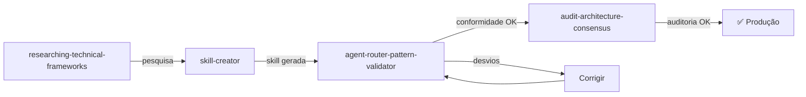

# Prompts de Framework (Ciclo de Vida)

1 prompt dedicado a validar projetos de agente.

---

## Visão Geral

| Prompt | Propósito | Output |
|--------|-----------|--------|
| `agent-router-pattern-validator` | Validar conformidade com Agent Router Pattern | Relatório de compliance |

---

## 1. agent-router-pattern-validator

> **Arquivo**: `.claude/skills/agent-router-pattern-validator/SKILL.md`

### Descrição
Analisa qualquer projeto de agente Claude Code e gera relatório de conformidade com o Agent Router Pattern, identificando desvios e propondo melhorias.

### Invocação
```
/agent-router-pattern-validator
```

### O que Verifica

| Aspecto | Verificação |
|---------|-------------|
| **Estrutura** | Todos os artefatos esperados presentes? |
| **Routing** | Prompts apontam para agents corretos? |
| **Skills Loading** | Agents referenciam skills que existem? |
| **Instructions Scope** | Instructions com applyTo adequado? |
| **Naming** | Kebab-case, gerund-form, coerência? |
| **YAML** | Frontmatter válido em todos os arquivos? |
| **Completude** | Nenhum dead-end ou componente órfão? |

### Input Esperado
- Caminho para diretório do projeto de agente (ou raiz do repo)

### Output Produzido
- Relatório markdown com:
  - Score de conformidade (%)
  - Desvios categorizados (Critical / Warning / Info)
  - Sugestões de correção para cada desvio
  - Diagrama de routing atual vs. ideal

### Tools Necessários
- `Read`, `Grep`

### Quando Usar
- Após criação de novo projeto de agente
- Após mudanças estruturais no projeto
- Como step de validação no [Fluxo de Criação de Projeto](../fluxos/fluxo-criacao-projeto.md)

---

## Fluxo Combinado



Ver: [Fluxo de Criação de Projeto](../fluxos/fluxo-criacao-projeto.md) para detalhes completos.
