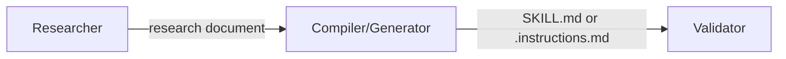

# Research Prompts

7 prompts dedicated to building validated, hallucination-free knowledge bases.

All follow the methodology defined in the `researching-technical-frameworks` skill and the `TEMPLATE.RESEARCH.prompt.md` pattern.

---

## Overview

| Prompt | Domain | Expected Input |
|--------|---------|---------------|
| `researching-technical-frameworks` | Technologies (FastAPI, Redis, Next.js...) | Technology + version + integration partners |
| `technical-framework-researcher-terraform` | Cloud + Terraform | Provider + service + Terraform version |
| `terraform-engineering-best-practices-researcher` | Terraform engineering practices | TF version + provider + team size + scale |
| `architecture-methodology-researcher` | Architecture methodologies | Methodology + edition + context |
| `cloud-architecture-researcher` | Cloud frameworks (WAF, CAF) | Provider + domain + edition |
| `business-domain-researcher` | Organizational domains | Domain + org context + regulatory URLs |
| `requirements-methodology-researcher` | Requirements frameworks | Framework + practice + team context |

---

## 1. researching-technical-frameworks

> **File**: `.claude/skills/researching-technical-frameworks/SKILL.md`

### Description
Researches software technologies and frameworks with version absolutism, producing a knowledge base validated against official documentation.

### Invocation
```
researching-technical-frameworks
```

### Input Variables
- **Technology**: Framework/library name (e.g., FastAPI, Redis, Spring Boot)
- **Version**: Specific version (e.g., v0.100, v7.2, 3.2.x)
- **Integration Partners**: Complementary technologies in the stack

### Output
Markdown research document with:
- Official patterns validated for the specific version
- Example code extracted from official docs
- Breaking changes vs previous versions
- Tested integrations

### Dependencies
- Skill: `researching-technical-frameworks`
- Template: `TEMPLATE.RESEARCH.prompt.md` (implicit)

### Next Steps
After research → use `skill-creator` to compile into SKILL.md

---

## 2. technical-framework-researcher-terraform

> **File**: `.claude/skills/technical-framework-researcher-terraform/SKILL.md`

### Description
Researches cloud services combined with Terraform, focusing on resources, data sources, and provisioning patterns.

### Invocation
```
technical-framework-researcher-terraform
```

### Input Variables
- **Cloud Provider**: AWS, OCI, Azure, GCP
- **Service**: Service name (e.g., Functions, API Gateway, S3)
- **Terraform Version**: Terraform CLI version
- **Provider Version**: Terraform provider version

### Output
Research document with:
- Available resources and data sources
- Required vs optional arguments
- Recommended module patterns
- Validated configuration examples

### Dependencies
- Skill: `researching-technical-frameworks`

### Next Steps
After research → use `skill-creator` to compile into a provisioning SKILL.md (e.g., `provisioning-aws-s3`)

---

> ### When to use which Terraform prompt?
>
> | Goal | Prompt | Compiler | Output |
> |----------|--------|----------|--------|
> | Provision a specific cloud service | `technical-framework-researcher-terraform` | `skill-creator` | SKILL.md per service (e.g., `provisioning-aws-s3`) |
> | Define Terraform project standards | `terraform-engineering-best-practices-researcher` | `terraform-instructions-compiler` | General .instructions.md (1 per project) |
>
> The two are complementary: the practices one defines the project framework; the service one fills it with resource-specific HCL.

---

## 3. terraform-engineering-best-practices-researcher

> **File**: `.claude/skills/terraform-engineering-best-practices-researcher/SKILL.md`

### Description
Researches Terraform engineering practices: project organization, modules, CI/CD, governance, testing.

### Invocation
```
terraform-engineering-best-practices-researcher
```

### Input Variables
- **Terraform Version**: CLI version
- **Provider**: Main provider
- **Team Size**: Small / Medium / Large
- **Scale**: Number of resources/environments

### Output
Research document with:
- Recommended directory structure
- Reusable module patterns
- CI/CD pipeline (plan → apply)
- State management strategies
- Testing practices (terratest, etc.)

### Dependencies
- Skill: `researching-technical-frameworks`

### Next Steps
After research → use `terraform-instructions-compiler` to generate .instructions.md

> **Note**: This research generates **one general skill per project** — do not repeat per service. For provisioning skills for specific services (e.g., S3, RDS, OCI Functions), use `technical-framework-researcher-terraform`.

---

## 4. architecture-methodology-researcher

> **File**: `.claude/skills/architecture-methodology-researcher/SKILL.md`

### Description
Researches architecture methodologies such as C4 Model, UML, ADR, TOGAF, DDD, Event-Driven Architecture.

### Invocation
```
architecture-methodology-researcher
```

### Input Variables
- **Methodology**: C4, TOGAF, DDD, Event-Driven, etc.
- **Edition/Version**: Specific edition of the framework
- **Context**: Type of system where it will be applied

### Output
Research document with:
- Fundamental concepts of the methodology
- Artifacts it produces
- When to use vs alternatives
- Application examples

### Dependencies
- Skill: `researching-technical-frameworks`

### Next Steps
After research → use `architecture-approaches-skill-generator` to compile into SKILL.md

---

## 5. cloud-architecture-researcher

> **File**: `.claude/skills/cloud-architecture-researcher/SKILL.md`

### Description
Researches cloud provider architecture frameworks (AWS Well-Architected, Azure CAF, GCP, OCI CAF).

### Invocation
```
cloud-architecture-researcher
```

### Input Variables
- **Provider**: AWS, Azure, GCP, OCI
- **Domain**: Framework pillar (Security, Reliability, Cost...)
- **Edition**: Framework version/edition

### Output
Research document with:
- Principles of the selected pillar
- Recommended design patterns
- Documented anti-patterns
- Compliance checklists

### Dependencies
- Skill: `researching-technical-frameworks`

---

## 6. business-domain-researcher

> **File**: `.claude/skills/business-domain-researcher/SKILL.md`

### Description
Researches organizational domains and business functions (Finance, Legal, HR, Compliance), including regulatory context.

### Invocation
```
business-domain-researcher
```

### Input Variables
- **Domain**: Functional area (Finance, Legal, HR, Compliance, Supply Chain)
- **Organizational Context**: Company type, industry, region
- **Regulatory URLs**: Links to applicable regulations

### Output
Research document with:
- Key domain processes
- Applicable regulatory requirements
- Ubiquitous language (DDD)
- Suggested bounded contexts

### Dependencies
- Skill: `researching-technical-frameworks`

---

## 7. requirements-methodology-researcher

> **File**: `.claude/skills/requirements-methodology-researcher/SKILL.md`

### Description
Researches requirements frameworks and agile practices (Scrum, SAFe, Shape Up, user stories, job stories).

### Invocation
```
requirements-methodology-researcher
```

### Input Variables
- **Framework**: Scrum, SAFe, Shape Up, Kanban
- **Practice Type**: User stories, job stories, acceptance criteria
- **Team Context**: Size, maturity, distribution

### Output
Research document with:
- Framework artifacts
- Writing templates
- Quality criteria (INVEST, etc.)
- Examples by maturity level

### Dependencies
- Skill: `researching-technical-frameworks`

### Next Steps
After research → use `methodologies-skill-generator` to compile into SKILL.md

---

## Combined Flow

All research prompts feed into the [Knowledge Base Flow](../fluxos/fluxo-base-conhecimento.md):


