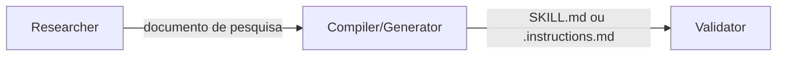

# Prompts de Pesquisa

7 prompts dedicados a construir bases de conhecimento validadas, livres de alucinações.

Todos seguem a metodologia definida na skill `researching-technical-frameworks` e o padrão do `TEMPLATE.RESEARCH.prompt.md`.

---

## Visão Geral

| Prompt | Domínio | Input Esperado |
|--------|---------|---------------|
| `researching-technical-frameworks` | Tecnologias (FastAPI, Redis, Next.js...) | Tecnologia + versão + parceiros de integração |
| `technical-framework-researcher-terraform` | Cloud + Terraform | Provider + serviço + versão Terraform |
| `terraform-engineering-best-practices-researcher` | Práticas de engenharia Terraform | Versão TF + provider + tamanho time + escala |
| `architecture-methodology-researcher` | Metodologias de arquitetura | Metodologia + edição + contexto |
| `cloud-architecture-researcher` | Frameworks de cloud (WAF, CAF) | Provider + domínio + edição |
| `business-domain-researcher` | Domínios organizacionais | Domínio + contexto org + URLs regulatórios |
| `requirements-methodology-researcher` | Frameworks de requisitos | Framework + prática + contexto de time |

---

## 1. researching-technical-frameworks

> **Arquivo**: `.claude/skills/researching-technical-frameworks/SKILL.md`

### Descrição
Pesquisa tecnologias e frameworks de software com version absolutism, produzindo base de conhecimento validada contra documentação oficial.

### Invocação
```
researching-technical-frameworks
```

### Input Variables
- **Tecnologia**: Nome do framework/biblioteca (ex: FastAPI, Redis, Spring Boot)
- **Versão**: Versão específica (ex: v0.100, v7.2, 3.2.x)
- **Parceiros de Integração**: Tecnologias complementares no stack

### Output
Documento de pesquisa em Markdown com:
- Padrões oficiais validados para a versão específica
- Código de exemplo extraído de docs oficiais
- Breaking changes vs versões anteriores
- Integrações testadas

### Dependências
- Skill: `researching-technical-frameworks`
- Template: `TEMPLATE.RESEARCH.prompt.md` (implícito)

### Próximos Passos
Após a pesquisa → usar `skill-creator` para compilar em SKILL.md

---

## 2. technical-framework-researcher-terraform

> **Arquivo**: `.claude/skills/technical-framework-researcher-terraform/SKILL.md`

### Descrição
Pesquisa serviços de cloud combinados com Terraform, focando em resources, data sources, e padrões de provisionamento.

### Invocação
```
technical-framework-researcher-terraform
```

### Input Variables
- **Cloud Provider**: AWS, OCI, Azure, GCP
- **Serviço**: Nome do serviço (ex: Functions, API Gateway, S3)
- **Versão Terraform**: Versão do Terraform CLI
- **Versão do Provider**: Versão do provider Terraform

### Output
Documento de pesquisa com:
- Resources e data sources disponíveis
- Argumentos obrigatórios vs opcionais
- Padrões de módulo recomendados
- Exemplos de configuração validados

### Dependências
- Skill: `researching-technical-frameworks`

### Próximos Passos
Após a pesquisa → usar `skill-creator` para compilar em SKILL.md de provisionamento (ex: `provisioning-aws-s3`)

---

> ### Quando usar qual prompt Terraform?
>
> | Objetivo | Prompt | Compiler | Output |
> |----------|--------|----------|--------|
> | Provisionar um serviço cloud específico | `technical-framework-researcher-terraform` | `skill-creator` | SKILL.md por serviço (ex: `provisioning-aws-s3`) |
> | Definir padrões de projeto Terraform | `terraform-engineering-best-practices-researcher` | `terraform-instructions-compiler` | .instructions.md geral (1 por projeto) |
>
> Os dois são complementares: o de práticas define o arcabouço do projeto; o de serviço preenche com HCL específico de cada recurso.

---

## 3. terraform-engineering-best-practices-researcher

> **Arquivo**: `.claude/skills/terraform-engineering-best-practices-researcher/SKILL.md`

### Descrição
Pesquisa práticas de engenharia Terraform: organização de projeto, módulos, CI/CD, governance, testes.

### Invocação
```
terraform-engineering-best-practices-researcher
```

### Input Variables
- **Versão Terraform**: Versão do CLI
- **Provider**: Provider principal
- **Tamanho do Time**: Pequeno / Médio / Grande
- **Escala**: Número de recursos/ambientes

### Output
Documento de pesquisa com:
- Estrutura de diretórios recomendada
- Padrões de módulos reutilizáveis
- Pipeline CI/CD (plan → apply)
- Estratégias de state management
- Práticas de teste (terratest, etc.)

### Dependências
- Skill: `researching-technical-frameworks`

### Próximos Passos
Após a pesquisa → usar `terraform-instructions-compiler` para gerar .instructions.md

> **Nota**: Esta pesquisa gera **uma skill geral por projeto** — não repetir por serviço. Para skills de provisionamento de serviços específicos (ex: S3, RDS, OCI Functions), use `technical-framework-researcher-terraform`.

---

## 4. architecture-methodology-researcher

> **Arquivo**: `.claude/skills/architecture-methodology-researcher/SKILL.md`

### Descrição
Pesquisa metodologias de arquitetura como C4 Model, UML, ADR, TOGAF, DDD, Event-Driven Architecture.

### Invocação
```
architecture-methodology-researcher
```

### Input Variables
- **Metodologia**: C4, TOGAF, DDD, Event-Driven, etc.
- **Edição/Versão**: Edição específica do framework
- **Contexto**: Tipo de sistema onde será aplicado

### Output
Documento de pesquisa com:
- Conceitos fundamentais da metodologia
- Artefatos que produz
- Quando usar vs alternativas
- Exemplos de aplicação

### Dependências
- Skill: `researching-technical-frameworks`

### Próximos Passos
Após a pesquisa → usar `architecture-approaches-skill-generator` para compilar em SKILL.md

---

## 5. cloud-architecture-researcher

> **Arquivo**: `.claude/skills/cloud-architecture-researcher/SKILL.md`

### Descrição
Pesquisa frameworks de arquitetura de cloud providers (AWS Well-Architected, Azure CAF, GCP, OCI CAF).

### Invocação
```
cloud-architecture-researcher
```

### Input Variables
- **Provider**: AWS, Azure, GCP, OCI
- **Domínio**: Pilar do framework (Security, Reliability, Cost...)
- **Edição**: Versão/edição do framework

### Output
Documento de pesquisa com:
- Princípios do pilar selecionado
- Design patterns recomendados
- Anti-patterns documentados
- Checklists de conformidade

### Dependências
- Skill: `researching-technical-frameworks`

---

## 6. business-domain-researcher

> **Arquivo**: `.claude/skills/business-domain-researcher/SKILL.md`

### Descrição
Pesquisa domínios organizacionais e funções de negócio (Finance, Legal, HR, Compliance), incluindo contexto regulatório.

### Invocação
```
business-domain-researcher
```

### Input Variables
- **Domínio**: Área funcional (Finance, Legal, HR, Compliance, Supply Chain)
- **Contexto Organizacional**: Tipo de empresa, setor, região
- **URLs Regulatórios**: Links para normas aplicáveis

### Output
Documento de pesquisa com:
- Processos-chave do domínio
- Requisitos regulatórios aplicáveis
- Vocabulário ubíquo (DDD)
- Bounded contexts sugeridos

### Dependências
- Skill: `researching-technical-frameworks`

---

## 7. requirements-methodology-researcher

> **Arquivo**: `.claude/skills/requirements-methodology-researcher/SKILL.md`

### Descrição
Pesquisa frameworks de requisitos e práticas ágeis (Scrum, SAFe, Shape Up, user stories, job stories).

### Invocação
```
requirements-methodology-researcher
```

### Input Variables
- **Framework**: Scrum, SAFe, Shape Up, Kanban
- **Tipo de Prática**: User stories, job stories, acceptance criteria
- **Contexto do Time**: Tamanho, maturidade, distribuição

### Output
Documento de pesquisa com:
- Artefatos do framework
- Templates de escrita
- Critérios de qualidade (INVEST, etc.)
- Exemplos por nível de maturidade

### Dependências
- Skill: `researching-technical-frameworks`

### Próximos Passos
Após a pesquisa → usar `methodologies-skill-generator` para compilar em SKILL.md

---

## Fluxo Combinado

Todos os prompts de pesquisa alimentam o [Fluxo de Base de Conhecimento](../fluxos/fluxo-base-conhecimento.md):


