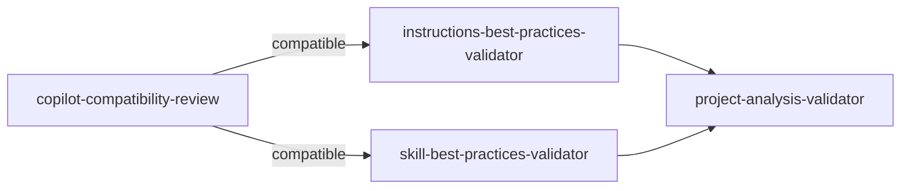

# Validation Prompts

4 prompts dedicated to verifying quality and compliance of framework artifacts.

All follow the `TEMPLATE.VALIDATION.prompt.md` pattern.

---

## Overview

| Prompt | Validates | Against | Output |
|--------|--------|--------|--------|
| `copilot-compatibility-review` | Any Copilot artifact | Official GitHub docs + ECI conventions | Compatibility report |
| `instructions-best-practices-validator` | `.instructions.md` | GitHub/VS Code docs + team conventions | Quality analysis |
| `skill-best-practices-validator` | `SKILL.md` | Claude best practices + `skill-creator` | Quality analysis |
| `project-analysis-validator` | Entire project | Quality framework + three-tier | Score + roadmap |

---

## 1. copilot-compatibility-review

> **File**: `.claude/skills/copilot-compatibility-review/SKILL.md`

### Description
Verifies compatibility of GitHub Copilot artifacts (`.agent.md`, `.instructions.md`, `.prompt.md`, `SKILL.md`) against official documentation.

### Invocation
```
copilot-compatibility-review
```

### What It Verifies
- Correct YAML frontmatter (fields, character limits)
- Compatibility with the VS Code engine
- Correct use of `applyTo`, `tools`, `agent`
- Adherence to documented limits

### Expected Input
- Path to repository/folder with Copilot artifacts

### Produced Output
- Markdown report with violations categorized by severity

### Dependencies
- No skill (self-contained)

### When to Use
- First check after creating any new artifact
- Before committing/PRing Copilot artifacts
- As step 1 of the [Quality Flow](../fluxos/fluxo-qualidade.md)

---

## 2. instructions-best-practices-validator

> **File**: `.claude/skills/instructions-best-practices-validator/SKILL.md`

### Description
Validates `.instructions.md` files against official GitHub/VS Code best practices and team conventions.

### Invocation
```
instructions-best-practices-validator
```

### What It Verifies
- File structure (mandatory sections)
- Clarity and conciseness of instructions
- Absence of contradictions
- Adherence to naming standards
- Appropriate scope (not too broad, not too narrow)

### Expected Input
- Path to directory containing `.instructions.md`

### Produced Output
- Quality analysis with prioritized improvement suggestions

### Dependencies
- No skill (validates against official docs internally)

### When to Use
- After `terraform-instructions-compiler` generates instructions
- When reviewing existing instructions
- As step 2 of the [Quality Flow](../fluxos/fluxo-qualidade.md)

---

## 3. skill-best-practices-validator

> **File**: `.claude/skills/skill-best-practices-validator/SKILL.md`

### Description
Validates `SKILL.md` against official Claude best practices and the pattern defined in `skill-creator`.

### Invocation
```
skill-best-practices-validator
```

### What It Verifies
- Correct three-tier (✅⚠️🚫 — presence and content)
- YAML frontmatter (name ≤64 chars, description ≤1536 chars)
- Version absolutism (one version per skill)
- Blueprints present and complete
- Example code in all ✅ Always Do
- Alternatives in all 🚫 Never Do
- Progressive disclosure (layered information)

### Expected Input
- Path to skills directory

### Produced Output
- Quality analysis with score and improvement items

### Dependencies
- Authoring patterns from `skill-creator` (validation baseline)

### When to Use
- After `skill-creator` or generators produce SKILL.md
- When reviewing existing skills
- As step 3 of the [Quality Flow](../fluxos/fluxo-qualidade.md)

---

## 4. project-analysis-validator

> **File**: `.claude/skills/project-analysis-validator/SKILL.md`

### Description
Holistic analysis of Claude Code agent projects (`.claude/`) and GitHub Copilot (`.github/`) — detects CLAUDE.md drift, invalid frontmatter, broken routing, and orphan components. Emits a prioritized score and remediation roadmap.

### Invocation
```
project-analysis-validator
```

### What It Verifies
- Project completeness (all necessary artifacts present)
- Consistency between artifacts (agent references skills that exist, etc.)
- Overall quality (no dead-ends, no broken references)
- Adherence to Agent Router Pattern
- Skills coverage (domain adequately covered)

### Expected Input
- Path to agent project directory

### Produced Output
- Quality score (0-100)
- Prioritized improvement roadmap
- Identified quick wins

### Dependencies
- No skill (holistic analysis)

### When to Use
- Final validation before "production"
- Periodic review of existing projects
- As step 4 (final) of the [Quality Flow](../fluxos/fluxo-qualidade.md)

---

## Recommended Validation Pipeline



Running in this order ensures: first technical compatibility, then content quality, and finally holistic consistency.

See: [Quality Flow](../fluxos/fluxo-qualidade.md) for full details.
