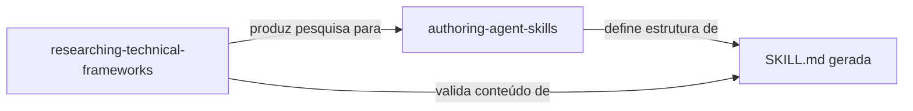

# Skills — Meta-Capacidades do Framework

O Agents Factory possui 2 meta-skills que definem os padrões fundamentais usados por todos os outros artefatos.

---

## 1. authoring-agent-skills

> **Arquivo**: `.github/skills/authoring-agent-skills/SKILL.md`

### Propósito
Define como criar e refinar Skills para GitHub Copilot seguindo best practices oficiais do Claude + convenções do time.

### Quando Usar
- Ao criar uma nova SKILL.md
- Ao revisar/melhorar uma skill existente
- Ao validar se uma skill segue os padrões

### Conteúdo Principal

| Seção | Descrição |
|-------|-----------|
| Core Principles | Regras fundamentais (version absolutism, naming, YAML) |
| Three-Tier Architecture | Sistema ✅⚠️🚫 obrigatório |
| YAML Frontmatter | Regras de `name`, `description`, `tools` |
| Progressive Disclosure | Como estruturar informação em camadas |
| Quality Checklist | Checklist final antes de publicar |
| Common Mistakes | Erros frequentes a evitar |

### Blueprints
- `blueprints/always-do-patterns.md` — Padrões obrigatórios com código
- `blueprints/never-do-patterns.md` — Anti-padrões com alternativas

### Usado por
- `skill-creator.prompt.md` — Referencia como padrão de qualidade
- `skill-best-practices-validator.prompt.md` — Usa como baseline de validação
- `architecture-approaches-skill-generator.prompt.md` — Segue o padrão
- `methodologies-skill-generator.prompt.md` — Segue o padrão

---

## 2. researching-technical-frameworks

> **Arquivo**: `.github/skills/researching-technical-frameworks/SKILL.md`

### Propósito
Define a metodologia de pesquisa para criar bases de conhecimento livres de alucinações, com validação contra fontes oficiais e versionamento rigoroso.

### Quando Usar
- Ao pesquisar qualquer tecnologia/framework nova
- Ao criar base de conhecimento para um domínio
- Ao validar se uma pesquisa segue o padrão de qualidade

### Conteúdo Principal

| Seção | Descrição |
|-------|-----------|
| Research Methodology | Etapas obrigatórias da pesquisa |
| Version Absolutism | Uma skill = uma versão. Nunca conflitar. |
| Decision Matrices | Breadth vs Depth, Cloud Provider Selection |
| Verification Loops | Como validar informações contra fontes |
| Output Structure | Formato do documento de pesquisa |

### Blueprints
- `blueprints/always-do-patterns.md` — Padrões de pesquisa obrigatórios
- `blueprints/never-do-patterns.md` — Anti-padrões de pesquisa

### Usado por
- `technical-framework-researcher.prompt.md` — Segue a metodologia
- `technical-framework-researcher-terraform.prompt.md` — Segue a metodologia
- `terraform-engineering-best-practices-researcher.prompt.md` — Segue a metodologia
- `architecture-methodology-researcher.prompt.md` — Segue a metodologia
- `cloud-architecture-researcher.prompt.md` — Segue a metodologia
- `business-domain-researcher.prompt.md` — Segue a metodologia
- `requirements-methodology-researcher.prompt.md` — Segue a metodologia
- Referencia `TEMPLATE.SKILL.md` (L459) como "Structure reference"

---

## Relação entre as Skills

A skill de **pesquisa** garante que o conteúdo é correto (fontes, versões). A skill de **autoria** garante que a estrutura é correta (three-tier, YAML, blueprints). Juntas formam o pipeline: pesquisa → compilação → skill validada.
