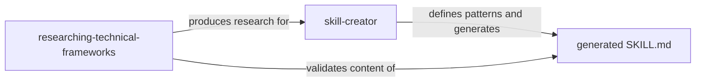

# Skills — Framework Base Capabilities

The Agents Factory has **2 base skills** in Claude Code: `skill-creator` (authoring patterns) and `researching-technical-frameworks` (research methodology, now a fork command). In Copilot, `authoring-agent-skills` is the skill equivalent to `skill-creator`.

---

## 1. skill-creator (integrated authoring patterns)

> **Claude Code file**: `.claude/skills/skill-creator/SKILL.md`  
> **Copilot equivalent**: `.github/skills/authoring-agent-skills/SKILL.md` *(Copilot keeps a separate skill)*

### Purpose
In Claude Code, `skill-creator` absorbed the authoring patterns (`authoring-agent-skills`) — it defines **how** to create skills (three tiers, YAML, blueprints) and **executes** generation from a research file, in a single artifact.

### When to Use
- When creating a new SKILL.md from a research file
- When reviewing/improving an existing skill (built-in patterns)
- When validating whether a skill follows the standards (via `skill-best-practices-validator`, which references this skill)

### Main Content

| Section | Description |
|-------|-----------|
| Authoring Standards | Core Principles, YAML rules, Three-Tier, Progressive Disclosure, Quality Checklist |
| Blueprints & Guardrails | Operational rules ✅⚠️🚫 for the generator itself |
| Execution Workflow | 6 generation steps from the research file |
| Three-Tier Architecture | Mandatory ✅⚠️🚫 system (blueprint) |
| Evaluation & Iteration | Iteration methodology with Claude A/B (blueprint) |

### Blueprints
- `blueprints/three-tier-architecture.md` — ✅⚠️🚫 framework with code examples
- `blueprints/evaluation-iteration.md` — Evaluation and iteration methodology (official)
- `blueprints/evaluation-scenarios.md` — 6 test scenarios (generator + authoring standards)

### Used by
- `skill-best-practices-validator` — Uses as validation baseline
- `architecture-approaches-skill-generator` — Follows the pattern
- `methodologies-skill-generator` — Follows the pattern
- `skill-author` (subagent) — Loads at P0 before generating any SKILL.md

---

## 2. researching-technical-frameworks

> **Claude Code file**: `.claude/skills/researching-technical-frameworks/SKILL.md`  
> **Copilot file**: `.github/skills/researching-technical-frameworks/SKILL.md`

### Purpose
Anti-hallucination research command: defines the methodology and executes research (forks to `framework-researcher`). Produces knowledge bases validated against official sources with strict versioning.

### When to Use
- `/researching-technical-frameworks <tech> <version>` — research any technology/framework
- When building a knowledge base for a domain (includes SDK, Terraform, methodologies via variants)
- As a methodology source for all other researchers

### Main Content

| Section | Description |
|-------|-----------|
| Research Methodology | Mandatory research steps |
| Version Absolutism | One skill = one version. Never conflict. |
| Decision Matrices | Breadth vs Depth, Cloud Provider Selection |
| Verification Loops | How to validate information against sources |
| Output Structure | Research document format |

### Blueprints
- `blueprints/always-do-patterns.md` — Mandatory research patterns
- `blueprints/ask-first-decisions.md` — Scope and cloud provider decisions
- `blueprints/never-do-patterns.md` — Research anti-patterns
- `blueprints/integration-patterns.md` — SDK/library template
- `blueprints/output-format-template.md` — Complete output document structure
- `blueprints/evaluation-scenarios.md` — 8 test scenarios

### Referenced by
- `framework-researcher` (agent) — loads as skill at P0
- `technical-framework-researcher-terraform` — references as base methodology
- All other researchers (`cloud-architecture-researcher`, `business-domain-researcher`, etc.) — follow the same methodology

---

## Relationship Between Skills

The **research** skill ensures content is correct (sources, versions). The **skill-creator** incorporates both the authoring patterns (three-tier, YAML, blueprints) and the generation itself. Together they form the pipeline: research → compilation → validated skill.
