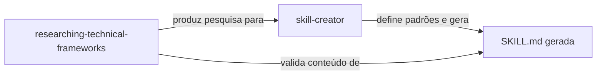

# Skills — Capacidades Base do Framework

O Agents Factory possui **2 skills base** no Claude Code: `skill-creator` (padrões de autoria) e `researching-technical-frameworks` (metodologia de pesquisa, agora um comando fork). No Copilot, `authoring-agent-skills` é a skill equivalente ao `skill-creator`.

---

## 1. skill-creator (padrões de autoria integrados)

> **Arquivo Claude Code**: `.claude/skills/skill-creator/SKILL.md`  
> **Equivalente Copilot**: `.github/skills/authoring-agent-skills/SKILL.md` *(Copilot mantém skill separada)*

### Propósito
No Claude Code, o `skill-creator` absorveu os padrões de autoria (`authoring-agent-skills`) — ele define **como** criar skills (três tiers, YAML, blueprints) e **executa** a geração a partir de um research file, em um único artefato.

### Quando Usar
- Ao criar uma nova SKILL.md a partir de um research file
- Ao revisar/melhorar uma skill existente (padrões embutidos)
- Ao validar se uma skill segue os padrões (via `skill-best-practices-validator`, que referencia este skill)

### Conteúdo Principal

| Seção | Descrição |
|-------|-----------|
| Authoring Standards | Core Principles, YAML rules, Three-Tier, Progressive Disclosure, Quality Checklist |
| Blueprints & Guardrails | Regras operacionais ✅⚠️🚫 do próprio gerador |
| Execution Workflow | 6 passos de geração a partir do research file |
| Three-Tier Architecture | Sistema ✅⚠️🚫 obrigatório (blueprint) |
| Evaluation & Iteration | Metodologia de iteração com Claude A/B (blueprint) |

### Blueprints
- `blueprints/three-tier-architecture.md` — Framework ✅⚠️🚫 com exemplos de código
- `blueprints/evaluation-iteration.md` — Metodologia de avaliação e iteração (oficial)
- `blueprints/evaluation-scenarios.md` — 6 cenários de teste (generator + authoring standards)

### Usado por
- `skill-best-practices-validator` — Usa como baseline de validação
- `architecture-approaches-skill-generator` — Segue o padrão
- `methodologies-skill-generator` — Segue o padrão
- `skill-author` (subagente) — Carrega em P0 antes de gerar qualquer SKILL.md

---

## 2. researching-technical-frameworks

> **Arquivo Claude Code**: `.claude/skills/researching-technical-frameworks/SKILL.md`  
> **Arquivo Copilot**: `.github/skills/researching-technical-frameworks/SKILL.md`

### Propósito
Comando de pesquisa anti-alucinação: define a metodologia e executa a pesquisa (forks para `framework-researcher`). Produz bases de conhecimento validadas contra fontes oficiais com versionamento rigoroso.

### Quando Usar
- `/researching-technical-frameworks <tech> <version>` — pesquisar qualquer tecnologia/framework
- Ao criar base de conhecimento para um domínio (inclui SDK, Terraform, metodologias via variantes)
- Como fonte de metodologia para todos os outros researchers

### Conteúdo Principal

| Seção | Descrição |
|-------|-----------|
| Research Methodology | Etapas obrigatórias da pesquisa |
| Version Absolutism | Uma skill = uma versão. Nunca conflitar. |
| Decision Matrices | Breadth vs Depth, Cloud Provider Selection |
| Verification Loops | Como validar informações contra fontes |
| Output Structure | Formato do documento de pesquisa |

### Blueprints
- `blueprints/always-do-patterns.md` — Padrões de pesquisa obrigatórios
- `blueprints/ask-first-decisions.md` — Decisões de escopo e cloud provider
- `blueprints/never-do-patterns.md` — Anti-padrões de pesquisa
- `blueprints/integration-patterns.md` — Template SDK/library
- `blueprints/output-format-template.md` — Estrutura completa do documento de saída
- `blueprints/evaluation-scenarios.md` — 8 cenários de teste

### Referenciado por
- `framework-researcher` (agente) — carrega como skill em P0
- `technical-framework-researcher-terraform` — referencia como metodologia base
- Todos os outros researchers (`cloud-architecture-researcher`, `business-domain-researcher`, etc.) — seguem a mesma metodologia

---

## Relação entre as Skills

A skill de **pesquisa** garante que o conteúdo é correto (fontes, versões). O **skill-creator** incorpora tanto os padrões de autoria (three-tier, YAML, blueprints) quanto a geração em si. Juntos formam o pipeline: pesquisa → compilação → skill validada.
