# Templates — Scaffolding de Artefatos

14 templates disponíveis para criar qualquer tipo de artefato do framework.

---

## Resumo por Categoria

| Categoria | Templates | Propósito |
|-----------|:---------:|-----------|
| Agent | 3 | Criar agentes (Implementation, Advisory, Orchestrator) |
| Prompt | 6 | Criar prompts por tipo de operação |
| Skill | 1 | Criar skills versionadas |
| Instruction | 3 | Criar instructions (Config, Standards, Skills-routing) |
| Report | 1 | Relatórios pós-incidente |

---

## Templates de Agent

### TEMPLATE.AGENT.md
> **Arquivo**: `.github/templates/agents/TEMPLATE.AGENT.md`

| Campo | Valor |
|-------|-------|
| **Padrão** | Implementation (P0-P5 completo) |
| **Gera código?** | ✅ Sim |
| **Quando usar** | Criar agente que implementa/gera código seguindo skills |
| **Referenciado por** | Nenhum prompt explicitamente (usar como referência manual ao criar novos agentes) |
| **Exemplo real** | `templates/examples/agents/oci-terraform.agent.md` |

### TEMPLATE.ADVISORY-AGENT.md
> **Arquivo**: `.github/templates/agents/TEMPLATE.ADVISORY-AGENT.md`

| Campo | Valor |
|-------|-------|
| **Padrão** | Advisory (P0-P5 read-only) |
| **Gera código?** | ❌ Não — produz designs, ADRs, diagramas |
| **Quando usar** | Criar agente de design/revisão que delega implementação |
| **Referenciado por** | Nenhum prompt explicitamente |
| **Exemplo real** | `templates/examples/agents/oci-serverless-architect.agent.md` |

### TEMPLATE.ORCHESTRATOR-AGENT.md
> **Arquivo**: `.github/templates/agents/TEMPLATE.ORCHESTRATOR-AGENT.md`

| Campo | Valor |
|-------|-------|
| **Padrão** | Orchestrator (P0-P5 cross-domain) |
| **Gera código?** | ✅ Sim — coordena múltiplos domínios |
| **Quando usar** | Criar agente que orquestra Java + Terraform, ou múltiplas skills |
| **Referenciado por** | Nenhum prompt explicitamente |
| **Exemplo real** | `templates/examples/agents/oci-serverless-stack.agent.md` |

---

## Templates de Prompt

### TEMPLATE.RESEARCH.prompt.md
> **Arquivo**: `.github/templates/prompts/TEMPLATE.RESEARCH.prompt.md`

| Campo | Valor |
|-------|-------|
| **Categoria** | Construção de conhecimento |
| **Quando usar** | Criar prompt que pesquisa tecnologia/metodologia |
| **Referenciado por** | Nenhum explicitamente |
| **Implementações que seguem** | `technical-framework-researcher`, `terraform-engineering-best-practices-researcher`, `architecture-methodology-researcher`, `cloud-architecture-researcher`, `business-domain-researcher`, `requirements-methodology-researcher`, `technical-framework-researcher-terraform` |

### TEMPLATE.GENERATOR.prompt.md
> **Arquivo**: `.github/templates/prompts/TEMPLATE.GENERATOR.prompt.md`

| Campo | Valor |
|-------|-------|
| **Categoria** | Compilação pesquisa → artefato |
| **Quando usar** | Criar prompt que transforma pesquisa em SKILL.md ou .instructions.md |
| **Referenciado por** | Nenhum explicitamente |
| **Implementações que seguem** | `skill-creator`, `architecture-approaches-skill-generator`, `methodologies-skill-generator`, `terraform-instructions-compiler` |

### TEMPLATE.VALIDATION.prompt.md
> **Arquivo**: `.github/templates/prompts/TEMPLATE.VALIDATION.prompt.md`

| Campo | Valor |
|-------|-------|
| **Categoria** | Avaliação de qualidade |
| **Quando usar** | Criar prompt que valida artefatos contra padrões |
| **Referenciado por** | Nenhum explicitamente |
| **Implementações que seguem** | `copilot-compatibility-review`, `instructions-best-practices-validator`, `skill-best-practices-validator`, `project-analysis-validator` |

### TEMPLATE.ENTRY-POINT.prompt.md
> **Arquivo**: `.github/templates/prompts/TEMPLATE.ENTRY-POINT.prompt.md`

| Campo | Valor |
|-------|-------|
| **Categoria** | Roteamento para agente |
| **Quando usar** | Criar prompt que coleta contexto e roteia para um agente |
| **Referenciado por** | Nenhum explicitamente |
| **Implementações que seguem** | Prompts com campo `agent:` no YAML (entry-points para agentes) |

### TEMPLATE.FEATURE-ADD.prompt.md
> **Arquivo**: `.github/templates/prompts/TEMPLATE.FEATURE-ADD.prompt.md`

| Campo | Valor |
|-------|-------|
| **Categoria** | Implementação guiada |
| **Quando usar** | Criar prompt que guia adição de feature específica |
| **Referenciado por** | Nenhum explicitamente |
| **Implementações que seguem** | Prompts de adição de funcionalidade (ex: `add-oci-function` nos exemplos) |

### TEMPLATE.DESIGN.prompt.md
> **Arquivo**: `.github/templates/prompts/TEMPLATE.DESIGN.prompt.md`

| Campo | Valor |
|-------|-------|
| **Categoria** | Design de arquitetura |
| **Quando usar** | Criar prompt que coleta contexto para agente advisory |
| **Referenciado por** | Nenhum explicitamente |
| **Implementações que seguem** | Prompts de design (ex: `design-api-gateway` nos exemplos) |

---

## Template de Skill

### TEMPLATE.SKILL.md
> **Arquivo**: `.github/templates/skills/TEMPLATE.SKILL.md`

| Campo | Valor |
|-------|-------|
| **Quando usar** | Criar qualquer nova SKILL.md |
| **Referenciado por** | ✅ `researching-technical-frameworks/SKILL.md` (L459) — "Structure reference" |
| **Implementações que seguem** | Todas as skills geradas pelos compilers |

---

## Templates de Instruction

### TEMPLATE.CONFIG.instructions.md
> **Arquivo**: `.github/templates/instructions/TEMPLATE.CONFIG.instructions.md`

| Campo | Valor |
|-------|-------|
| **Propósito** | Setup de projeto, dependências, estrutura |
| **Referenciado por** | ✅ `terraform-instructions-compiler.prompt.md` (L55) |
| **Quando usar** | Criar instruction de configuração de projeto |

### TEMPLATE.STANDARDS.instructions.md
> **Arquivo**: `.github/templates/instructions/TEMPLATE.STANDARDS.instructions.md`

| Campo | Valor |
|-------|-------|
| **Propósito** | Padrões de código, naming, qualidade |
| **Referenciado por** | ✅ `terraform-instructions-compiler.prompt.md` (L54) |
| **Quando usar** | Criar instruction de coding standards |

### TEMPLATE.SKILLS.instructions.md
> **Arquivo**: `.github/templates/instructions/TEMPLATE.SKILLS.instructions.md`

| Campo | Valor |
|-------|-------|
| **Propósito** | Roteamento de skills (quais skills carregar por keyword) |
| **Referenciado por** | ✅ `terraform-instructions-compiler.prompt.md` (L56) |
| **Quando usar** | Criar instruction que mapeia keywords → skills |

---

## Template de Report

### POST_MORTEM_TEMPLATE.md
> **Arquivo**: `.github/templates/reports/POST_MORTEM_TEMPLATE.md`

| Campo | Valor |
|-------|-------|
| **Propósito** | Análise pós-incidente |
| **Referenciado por** | ❌ Nenhum (órfão) |
| **Quando usar** | Documentar post-mortem de incidentes |

---

## Rastreabilidade: Template → Implementações

```mermaid
graph TD
    subgraph "Templates"
        TA[TEMPLATE.AGENT]
        TAD[TEMPLATE.ADVISORY-AGENT]
        TO[TEMPLATE.ORCHESTRATOR-AGENT]
        TR[TEMPLATE.RESEARCH.prompt]
        TG[TEMPLATE.GENERATOR.prompt]
        TV[TEMPLATE.VALIDATION.prompt]
        TE[TEMPLATE.ENTRY-POINT.prompt]
        TF[TEMPLATE.FEATURE-ADD.prompt]
        TD[TEMPLATE.DESIGN.prompt]
        TS[TEMPLATE.SKILL]
        TCI[TEMPLATE.CONFIG.instructions]
        TSI[TEMPLATE.STANDARDS.instructions]
        TKI[TEMPLATE.SKILLS.instructions]
    end

    subgraph "Implementações"
        TR --> P1[7 prompts de pesquisa]
        TG --> P2[4 prompts de compilação]
        TV --> P3[4 prompts de validação]
        TS --> SK[Skills geradas]
        TCI --> I1[*.config.instructions.md]
        TSI --> I2[*.standards.instructions.md]
        TKI --> I3[*.skills.instructions.md]
    end

    style TA fill:#fff3cd
    style TAD fill:#fff3cd
    style TO fill:#fff3cd
    style TE fill:#fff3cd
    style TF fill:#fff3cd
    style TD fill:#fff3cd
```

> ⚠️ **Templates em amarelo**: Sem implementações explícitas encontradas no repositório. São usados como referência manual ao criar novos artefatos.

---

## Discrepâncias Identificadas

| Issue | Descrição | Ação Sugerida |
|-------|-----------|---------------|
| README fantasma | `templates/README.md` menciona `TEMPLATE.COMPILER.prompt.md` — arquivo não existe | Verificar se foi renomeado para `TEMPLATE.GENERATOR.prompt.md` |
| README fantasma | `templates/README.md` menciona `TEMPLATE.SCAFFOLDING.prompt.md` — arquivo não existe | Verificar se foi renomeado ou removido |
| Órfão | `POST_MORTEM_TEMPLATE.md` sem nenhuma referência | Considerar integrar em algum fluxo ou remover |
