# Templates — Artifact Scaffolding

14 templates available to create any type of framework artifact.

> **System coexistence**: Templates exist in two mirrored locations — `.github/templates/` (GitHub Copilot) and `.claude/templates/` (Claude Code). The only structural difference is that `.github/` uses `instructions/` while `.claude/` uses `rules/` for scope instruction templates.

---

---

## Summary by Category

| Category | Templates | Purpose |
|-----------|:---------:|-----------|
| Agent | 3 | Create agents (Implementation, Advisory, Orchestrator) |
| Prompt | 6 | Create prompts by operation type |
| Skill | 1 | Create versioned skills |
| Instruction | 3 | Create instructions (Config, Standards, Skills-routing) |
| Report | 1 | Post-incident reports |

---

## Agent Templates

### TEMPLATE.AGENT.md
> **File**: `.github/templates/agents/TEMPLATE.AGENT.md`

| Field | Value |
|-------|-------|
| **Pattern** | Implementation (full P0-P5) |
| **Generates code?** | ✅ Yes |
| **When to use** | Create an agent that implements/generates code following skills |
| **Referenced by** | No prompt explicitly (use as manual reference when creating new agents) |
| **Real example** | `templates/examples/agents/oci-terraform.agent.md` |

### TEMPLATE.ADVISORY-AGENT.md
> **File**: `.github/templates/agents/TEMPLATE.ADVISORY-AGENT.md`

| Field | Value |
|-------|-------|
| **Pattern** | Advisory (P0-P5 read-only) |
| **Generates code?** | ❌ No — produces designs, ADRs, diagrams |
| **When to use** | Create a design/review agent that delegates implementation |
| **Referenced by** | No prompt explicitly |
| **Real example** | `templates/examples/agents/oci-serverless-architect.agent.md` |

### TEMPLATE.ORCHESTRATOR-AGENT.md
> **File**: `.github/templates/agents/TEMPLATE.ORCHESTRATOR-AGENT.md`

| Field | Value |
|-------|-------|
| **Pattern** | Orchestrator (P0-P5 cross-domain) |
| **Generates code?** | ✅ Yes — coordinates multiple domains |
| **When to use** | Create an agent that orchestrates Java + Terraform, or multiple skills |
| **Referenced by** | No prompt explicitly |
| **Real example** | `templates/examples/agents/oci-serverless-stack.agent.md` |

---

## Prompt Templates

### TEMPLATE.RESEARCH.prompt.md
> **File**: `.github/templates/prompts/TEMPLATE.RESEARCH.prompt.md`

| Field | Value |
|-------|-------|
| **Category** | Knowledge building |
| **When to use** | Create a prompt that researches a technology/methodology |
| **Referenced by** | None explicitly |
| **Implementations that follow** | `researching-technical-frameworks`, `terraform-engineering-best-practices-researcher`, `architecture-methodology-researcher`, `cloud-architecture-researcher`, `business-domain-researcher`, `requirements-methodology-researcher`, `technical-framework-researcher-terraform` |

### TEMPLATE.GENERATOR.prompt.md
> **File**: `.github/templates/prompts/TEMPLATE.GENERATOR.prompt.md`

| Field | Value |
|-------|-------|
| **Category** | Research → artifact compilation |
| **When to use** | Create a prompt that transforms research into SKILL.md or .instructions.md |
| **Referenced by** | None explicitly |
| **Implementations that follow** | `skill-creator`, `architecture-approaches-skill-generator`, `methodologies-skill-generator`, `terraform-instructions-compiler` |

### TEMPLATE.VALIDATION.prompt.md
> **File**: `.github/templates/prompts/TEMPLATE.VALIDATION.prompt.md`

| Field | Value |
|-------|-------|
| **Category** | Quality assessment |
| **When to use** | Create a prompt that validates artifacts against standards |
| **Referenced by** | None explicitly |
| **Implementations that follow** | `copilot-compatibility-review`, `instructions-best-practices-validator`, `skill-best-practices-validator`, `project-analysis-validator` |

### TEMPLATE.ENTRY-POINT.prompt.md
> **File**: `.github/templates/prompts/TEMPLATE.ENTRY-POINT.prompt.md`

| Field | Value |
|-------|-------|
| **Category** | Routing to agent |
| **When to use** | Create a prompt that collects context and routes to an agent |
| **Referenced by** | None explicitly |
| **Implementations that follow** | Prompts with `agent:` field in YAML (entry-points for agents) |

### TEMPLATE.FEATURE-ADD.prompt.md
> **File**: `.github/templates/prompts/TEMPLATE.FEATURE-ADD.prompt.md`

| Field | Value |
|-------|-------|
| **Category** | Guided implementation |
| **When to use** | Create a prompt that guides adding a specific feature |
| **Referenced by** | None explicitly |
| **Implementations that follow** | Feature addition prompts (e.g., `add-oci-function` in examples) |

### TEMPLATE.DESIGN.prompt.md
> **File**: `.github/templates/prompts/TEMPLATE.DESIGN.prompt.md`

| Field | Value |
|-------|-------|
| **Category** | Architecture design |
| **When to use** | Create a prompt that collects context for an advisory agent |
| **Referenced by** | None explicitly |
| **Implementations that follow** | Design prompts (e.g., `design-api-gateway` in examples) |

---

## Skill Template

### TEMPLATE.SKILL.md
> **File**: `.github/templates/skills/TEMPLATE.SKILL.md`

| Field | Value |
|-------|-------|
| **When to use** | Create any new SKILL.md |
| **Referenced by** | ✅ `researching-technical-frameworks/SKILL.md` (L459) — "Structure reference" |
| **Implementations that follow** | All skills generated by compilers |

---

## Instruction Templates

### TEMPLATE.CONFIG.instructions.md
> **File**: `.github/templates/instructions/TEMPLATE.CONFIG.instructions.md`

| Field | Value |
|-------|-------|
| **Purpose** | Project setup, dependencies, structure |
| **Referenced by** | ✅ `terraform-instructions-compiler.prompt.md` (L55) |
| **When to use** | Create a project configuration instruction |

### TEMPLATE.STANDARDS.instructions.md
> **File**: `.github/templates/instructions/TEMPLATE.STANDARDS.instructions.md`

| Field | Value |
|-------|-------|
| **Purpose** | Code standards, naming, quality |
| **Referenced by** | ✅ `terraform-instructions-compiler.prompt.md` (L54) |
| **When to use** | Create a coding standards instruction |

### TEMPLATE.SKILLS.instructions.md
> **File**: `.github/templates/instructions/TEMPLATE.SKILLS.instructions.md`

| Field | Value |
|-------|-------|
| **Purpose** | Skills routing (which skills to load per keyword) |
| **Referenced by** | ✅ `terraform-instructions-compiler.prompt.md` (L56) |
| **When to use** | Create an instruction that maps keywords → skills |

---

## Report Template

### POST_MORTEM_TEMPLATE.md
> **File**: `.github/templates/reports/POST_MORTEM_TEMPLATE.md`

| Field | Value |
|-------|-------|
| **Purpose** | Post-incident analysis |
| **Referenced by** | ❌ None (orphan) |
| **When to use** | Document incident post-mortems |

---

## Traceability: Template → Implementations

```mermaid
graph TD
    subgraph "Templates"
        TA[TEMPLATE.AGENT]
        TAD[TEMPLATE.ADVISORY-AGENT]
        TO[TEMPLATE.ORCHESTRATOR-AGENT]
        TR[TEMPLATE.RESEARCH.prompt]
        TG[TEMPLATE.GENERATOR.prompt]
        TV[TEMPLATE.VALIDATION.prompt]
        TE[TEMPLATE.ENTRY-POINT.prompt]
        TF[TEMPLATE.FEATURE-ADD.prompt]
        TD[TEMPLATE.DESIGN.prompt]
        TS[TEMPLATE.SKILL]
        TCI[TEMPLATE.CONFIG.instructions]
        TSI[TEMPLATE.STANDARDS.instructions]
        TKI[TEMPLATE.SKILLS.instructions]
    end

    subgraph "Implementations"
        TR --> P1[7 research prompts]
        TG --> P2[4 compilation prompts]
        TV --> P3[4 validation prompts]
        TS --> SK[Generated skills]
        TCI --> I1[*.config.instructions.md]
        TSI --> I2[*.standards.instructions.md]
        TKI --> I3[*.skills.instructions.md]
    end

    style TA fill:#fff3cd
    style TAD fill:#fff3cd
    style TO fill:#fff3cd
    style TE fill:#fff3cd
    style TF fill:#fff3cd
    style TD fill:#fff3cd
```

> ⚠️ **Templates in yellow**: No explicit implementations found in the repository. They are used as manual references when creating new artifacts.

---

## Identified Discrepancies

| Issue | Description | Suggested Action |
|-------|-----------|---------------|
| Ghost README | `templates/README.md` mentions `TEMPLATE.COMPILER.prompt.md` — file does not exist | Verify if it was renamed to `TEMPLATE.GENERATOR.prompt.md` |
| Ghost README | `templates/README.md` mentions `TEMPLATE.SCAFFOLDING.prompt.md` — file does not exist | Verify if it was renamed or removed |
| Orphan | `POST_MORTEM_TEMPLATE.md` with no references | Consider integrating into a flow or removing |
