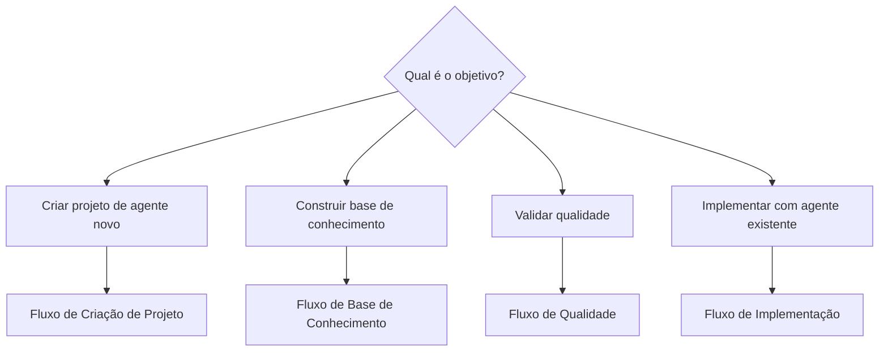
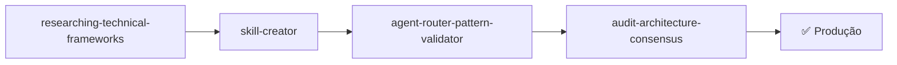
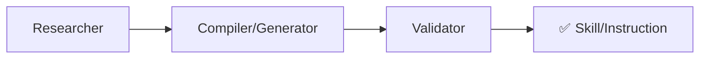
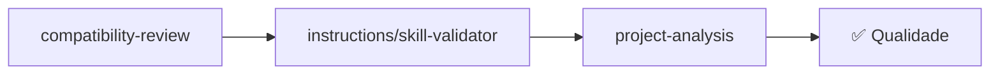
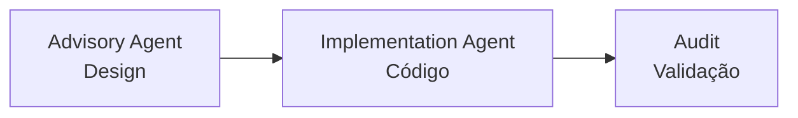
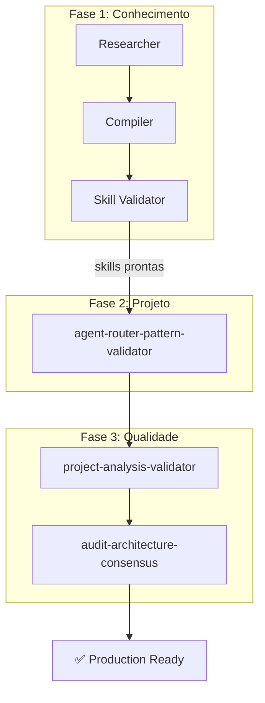

# Fluxos Combinados

Pipelines de ponta-a-ponta que combinam múltiplas capacidades complementares.

---

## Mapa Geral

---

## Os 4 Fluxos

### 1. [Fluxo de Criação de Projeto](fluxo-criacao-projeto.md)

**Objetivo**: Criar um projeto de agente production-ready do zero.

**Capacidades envolvidas**: 1 de framework + 4 de auditoria + pesquisa + compilação

---

### 2. [Fluxo de Base de Conhecimento](fluxo-base-conhecimento.md)

**Objetivo**: Pesquisar tecnologia e transformar em skill/instruction operacional.

**Capacidades envolvidas**: 7 de pesquisa + 4 de compilação + 2 de validação

---

### 3. [Fluxo de Qualidade](fluxo-qualidade.md)

**Objetivo**: Verificar e melhorar qualidade de artefatos existentes.

**Capacidades envolvidas**: 4 de validação + (opcional) 5 de auditoria

---

### 4. [Fluxo de Implementação](fluxo-implementacao.md)

**Objetivo**: Usar agentes existentes para design + implementação.

**Capacidades envolvidas**: Agents (Advisory → Implementation) + Auditoria

---

## Quando Usar Qual Fluxo

| Situação | Fluxo |
|----------|-------|
| Começando domínio novo de automação | Criação de Projeto |
| Aprendendo tecnologia nova | Base de Conhecimento |
| Revisão de qualidade periódica | Qualidade |
| Projeto de agente já existe, quer usar | Implementação |
| Tudo do zero (tecnologia nova + agente) | Base de Conhecimento → Criação de Projeto |

---

## Composição entre Fluxos

Os fluxos se complementam. Cenário completo "do zero até produção":

