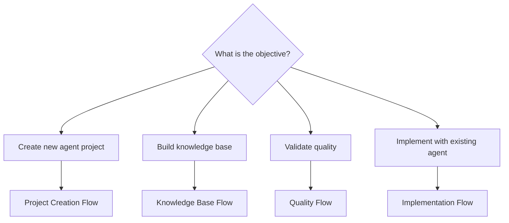
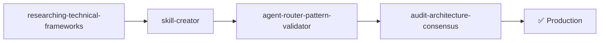
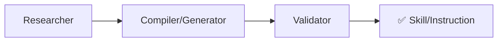
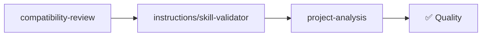
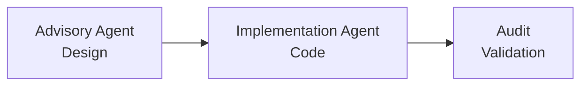
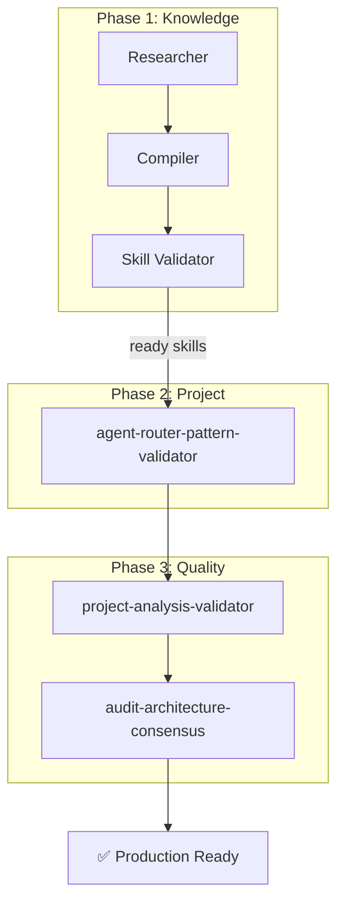

# Combined Flows

End-to-end pipelines that combine multiple complementary capabilities.

---

## General Map

---

## The 4 Flows

### 1. [Project Creation Flow](fluxo-criacao-projeto.md)

**Objective**: Create a production-ready agent project from scratch.

**Capabilities involved**: 1 framework + 4 audit + research + compilation

---

### 2. [Knowledge Base Flow](fluxo-base-conhecimento.md)

**Objective**: Research a technology and transform it into an operational skill/instruction.

**Capabilities involved**: 7 research + 4 compilation + 2 validation

---

### 3. [Quality Flow](fluxo-qualidade.md)

**Objective**: Verify and improve the quality of existing artifacts.

**Capabilities involved**: 4 validation + (optional) 5 audit

---

### 4. [Implementation Flow](fluxo-implementacao.md)

**Objective**: Use existing agents for design + implementation.

**Capabilities involved**: Agents (Advisory → Implementation) + Audit

---

## When to Use Which Flow

| Situation | Flow |
|----------|-------|
| Starting a new automation domain | Project Creation |
| Learning a new technology | Knowledge Base |
| Periodic quality review | Quality |
| Agent project already exists, want to use it | Implementation |
| Everything from scratch (new technology + agent) | Knowledge Base → Project Creation |

---

## Flow Composition

The flows complement each other. Complete scenario "from scratch to production":

