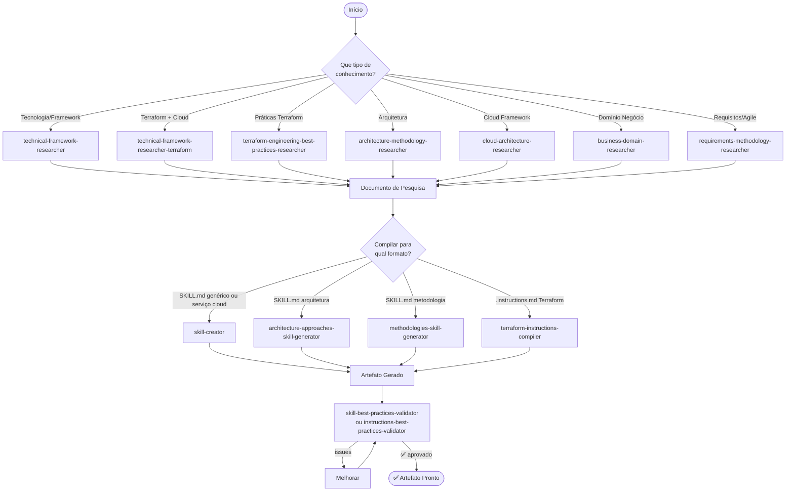
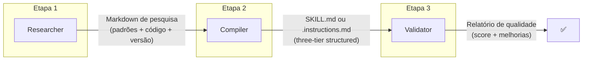

# Fluxo: Base de Conhecimento

Pesquisar uma tecnologia/metodologia e transformar em artefato operacional (SKILL.md ou .instructions.md).

---

## Diagrama



---

## Etapas Detalhadas

### Etapa 1: Pesquisa

**Escolha o researcher baseado no domínio:**

| Se você precisa de... | Use |
|----------------------|-----|
| Padrões de FastAPI v0.100 | `technical-framework-researcher` |
| Resources Terraform do OCI Functions | `technical-framework-researcher-terraform` |
| Estrutura de projeto Terraform | `terraform-engineering-best-practices-researcher` |
| Padrões C4 Model ou DDD | `architecture-methodology-researcher` |
| AWS Well-Architected | `cloud-architecture-researcher` |
| Processos de compliance financeira | `business-domain-researcher` |
| Práticas SAFe ou Shape Up | `requirements-methodology-researcher` |

**Input**: Tecnologia + versão + contexto
**Output**: Documento markdown de pesquisa validada

> ⚠️ Regra: sempre fornecer versão específica. Sem versão = sem pesquisa.

---

### Etapa 2: Compilação

**Escolha o compiler baseado no output desejado:**

| Pesquisa de... | Compiler | Output |
|---------------|----------|--------|
| Tecnologia genérica | `skill-creator` | `SKILL.md` + `blueprints/` |
| Serviço cloud + Terraform (`technical-framework-researcher-terraform`) | `skill-creator` | `SKILL.md` de provisionamento |
| Arquitetura (C4, DDD) | `architecture-approaches-skill-generator` | `SKILL.md` |
| Metodologia (Scrum, SAFe) | `methodologies-skill-generator` | `SKILL.md` |
| Práticas Terraform (`terraform-engineering-best-practices-researcher`) | `terraform-instructions-compiler` | Múltiplos `.instructions.md` |

**Input**: Documento de pesquisa (output da Etapa 1)
**Output**: Artefato operacional estruturado em three-tier

---

### Etapa 3: Validação

| Se gerou... | Valide com |
|------------|-----------|
| SKILL.md | `skill-best-practices-validator` |
| .instructions.md | `instructions-best-practices-validator` |

**Input**: Artefato gerado (output da Etapa 2)
**Output**: Relatório de qualidade + sugestões de melhoria

---

## Variantes do Fluxo

### Variante A: Skill de tecnologia
```
technical-framework-researcher → skill-creator → skill-best-practices-validator
```

### Variante B: Instructions Terraform
```
terraform-engineering-best-practices-researcher → terraform-instructions-compiler → instructions-best-practices-validator
```

### Variante C: Skill de arquitetura
```
architecture-methodology-researcher → architecture-approaches-skill-generator → skill-best-practices-validator
```

### Variante D: Skill de metodologia
```
requirements-methodology-researcher → methodologies-skill-generator → skill-best-practices-validator
```

---

## Capacidades Envolvidas

| Etapa | Capacidades | Qtd |
|-------|------------|:---:|
| Pesquisa | 7 researchers | 7 |
| Compilação | 4 compilers/generators | 4 |
| Validação | 2 validators | 2 |
| **Total** | | **13** |

---

## Inputs e Outputs entre Etapas



---

## Resultado Final

- **SKILL.md**: Base de conhecimento versionada pronta para ser carregada por agentes
- **OU .instructions.md**: Configuração de projeto pronta para ser injetada automaticamente

## Próximos Passos

Após ter skills prontas:
- Usá-las em um agente existente → [Fluxo de Implementação](fluxo-implementacao.md)
- Criar um agente novo que use essas skills → [Fluxo de Criação de Projeto](fluxo-criacao-projeto.md)
