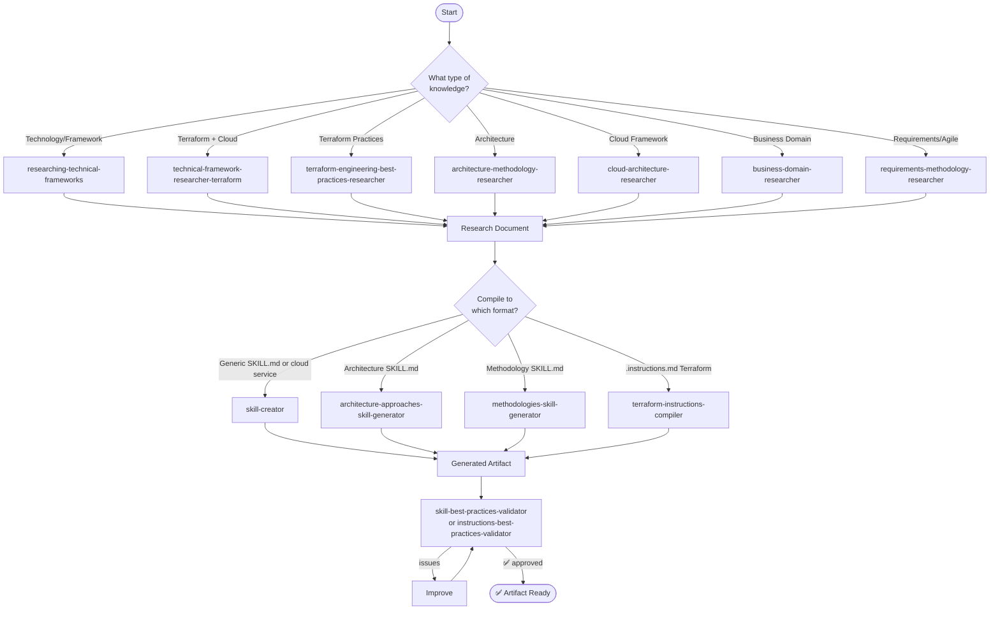
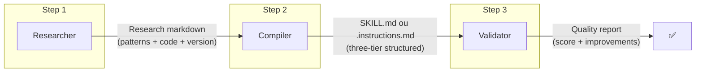

# Flow: Knowledge Base

Research a technology/methodology and transform it into an operational artifact (SKILL.md or .instructions.md).

---

## Diagram



---

## Detailed Steps

### Step 1: Research

**Choose the researcher based on the domain:**

| If you need... | Use |
|----------------------|-----|
| FastAPI v0.100 patterns | `researching-technical-frameworks` |
| OCI Functions Terraform resources | `technical-framework-researcher-terraform` |
| Terraform project structure | `terraform-engineering-best-practices-researcher` |
| C4 Model or DDD patterns | `architecture-methodology-researcher` |
| AWS Well-Architected | `cloud-architecture-researcher` |
| Financial compliance processes | `business-domain-researcher` |
| SAFe or Shape Up practices | `requirements-methodology-researcher` |

**Input**: Technology + version + context
**Output**: Validated research markdown document

> ⚠️ Rule: always provide a specific version. No version = no research.

---

### Step 2: Compilation

**Choose the compiler based on the desired output:**

| Research of... | Compiler | Output |
|---------------|----------|--------|
| Generic technology | `skill-creator` | `SKILL.md` + `blueprints/` |
| Cloud service + Terraform (`technical-framework-researcher-terraform`) | `skill-creator` | `SKILL.md` for provisioning |
| Architecture (C4, DDD) | `architecture-approaches-skill-generator` | `SKILL.md` |
| Methodology (Scrum, SAFe) | `methodologies-skill-generator` | `SKILL.md` |
| Terraform practices (`terraform-engineering-best-practices-researcher`) | `terraform-instructions-compiler` | Multiple `.instructions.md` |

**Input**: Research document (output from Step 1)
**Output**: Operational artifact structured in Three-Tier

---

### Step 3: Validation

| If you generated... | Validate with |
|------------|-----------|
| SKILL.md | `skill-best-practices-validator` |
| .instructions.md | `instructions-best-practices-validator` |

**Input**: Generated artifact (output from Step 2)
**Output**: Quality report + improvement suggestions

---

## Flow Variants

### Variant A: Technology Skill
```
researching-technical-frameworks → skill-creator → skill-best-practices-validator
```

### Variant B: Terraform Instructions
```
terraform-engineering-best-practices-researcher → terraform-instructions-compiler → instructions-best-practices-validator
```

### Variant C: Architecture Skill
```
architecture-methodology-researcher → architecture-approaches-skill-generator → skill-best-practices-validator
```

### Variant D: Methodology Skill
```
requirements-methodology-researcher → methodologies-skill-generator → skill-best-practices-validator
```

---

## Capabilities Involved

| Step | Capabilities | Qty |
|-------|------------|:---:|
| Research | 7 researchers | 7 |
| Compilation | 4 compilers/generators | 4 |
| Validation | 2 validators | 2 |
| **Total** | | **13** |

---

## Inputs and Outputs Between Steps



---

## Final Result

- **SKILL.md**: Versioned knowledge base ready to be loaded by agents
- **OR .instructions.md**: Project configuration ready to be automatically injected

## Next Steps

After having ready skills:
- Use them in an existing agent → [Implementation Flow](fluxo-implementacao.md)
- Create a new agent that uses these skills → [Project Creation Flow](fluxo-criacao-projeto.md)
