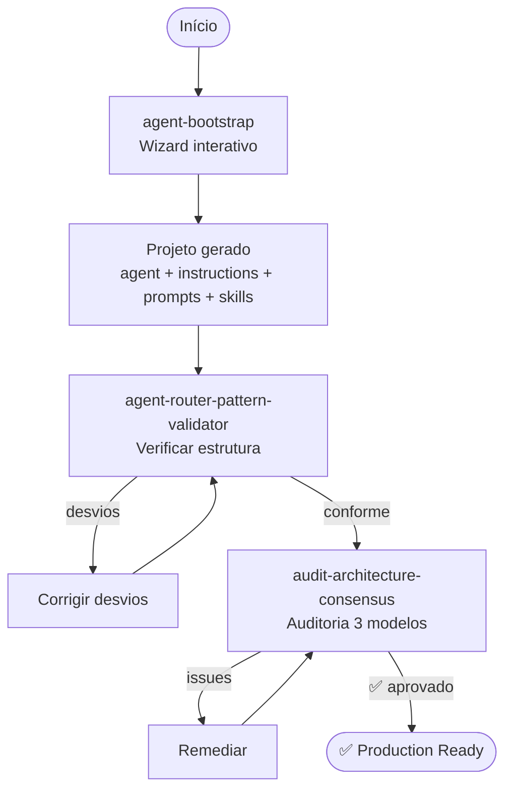

# Fluxo: Criação de Projeto

Criar um projeto de agente production-ready do zero, desde o bootstrap até auditoria completa.

---

## Diagrama

---

## Etapas Detalhadas

### Etapa 1: Bootstrap

**Prompt**: `@workspace /agent-bootstrap`

**O que acontece**:
- Wizard faz perguntas sobre domínio, tipo, skills
- Gera toda a estrutura de arquivos

**Input**: Respostas interativas
**Output**: Projeto completo (estrutura de arquivos)

**Duração típica**: 5-10 minutos (interativo)

---

### Etapa 2: Validação de Estrutura

**Prompt**: `@workspace /agent-router-pattern-validator`

**O que acontece**:
- Verifica se Agent Router Pattern está correto
- Identifica referências quebradas, naming errado, dead-ends

**Input**: Diretório do projeto gerado
**Output**: Relatório com score + desvios

**Se houver desvios**:
1. Ler relatório
2. Corrigir cada desvio listado
3. Re-executar validator
4. Repetir até score satisfatório

---

### Etapa 3: Auditoria Multi-Modelo

**Prompt**: `@workspace /audit-architecture-consensus`

**O que acontece**:
- Modelo A verifica hierarquia de responsabilidades (L0→L4)
- Modelo B verifica cadeias de invocação (reachability)
- Modelo C verifica mecânicas do VS Code engine
- Orquestrador compara e prioriza por consenso

**Input**: Nome do agente ou path
**Output**: Relatório priorizado com remediações

**Se houver issues**:
1. Focar em issues 3/3 (todos os modelos concordam) primeiro
2. Depois 2/3
3. Issues 1/3 podem ser aceitas como risco

---

## Capacidades Envolvidas

| Etapa | Capacidade | Tipo |
|-------|-----------|------|
| 1 | `agent-bootstrap` | Framework |
| 2 | `agent-router-pattern-validator` | Framework |
| 3 | `audit-architecture-scope` | Auditoria |
| 3 | `audit-architecture-flow` | Auditoria |
| 3 | `audit-architecture-engine` | Auditoria |
| 3 | `audit-architecture-consensus` | Auditoria |

---

## Pré-requisitos

- Saber qual domínio o agente vai cobrir
- Ter ideia de quais skills serão necessárias (mesmo que placeholders)

## Resultado Final

Projeto com:
- ✅ Estrutura conforme Agent Router Pattern
- ✅ Hierarquia de responsabilidades correta
- ✅ Cadeias de invocação completas
- ✅ Mecânicas VS Code compatíveis

## Próximos Passos

Após criar o projeto, as skills geradas são placeholders. Para preenchê-las:
→ [Fluxo de Base de Conhecimento](fluxo-base-conhecimento.md)
