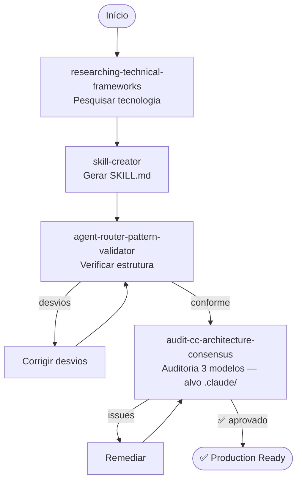

# Fluxo: Criação de Projeto

Criar um projeto de agente production-ready do zero, desde o bootstrap até auditoria completa.

---

## Diagrama

---

## Etapas Detalhadas

### Etapa 1: Pesquisa de Tecnologia

**Prompt**: `/researching-technical-frameworks <tech>`

**O que acontece**:
- Pesquisa a tecnologia/framework com fontes oficiais
- Produz documento de pesquisa source-dated

**Input**: Nome da tecnologia e versão alvo
**Output**: Documento de pesquisa validado

**Duração típica**: 5-10 minutos

---

### Etapa 2: Criação de Skill

**Prompt**: `/skill-creator`

**O que acontece**:
- Transforma o documento de pesquisa em SKILL.md operacional
- Aplica padrões three-tier (✅⚠️🚫) e version absolutism

**Input**: Documento de pesquisa da Etapa 1
**Output**: SKILL.md pronta para uso por agentes

**Duração típica**: 3-5 minutos

---

### Etapa 3: Validação de Estrutura

**Prompt**: `/agent-router-pattern-validator`

**O que acontece**:
- Verifica se Agent Router Pattern está correto
- Identifica referências quebradas, naming errado, dead-ends

**Input**: Diretório do projeto gerado
**Output**: Relatório com score + desvios

**Se houver desvios**:
1. Ler relatório
2. Corrigir cada desvio listado
3. Re-executar validator
4. Repetir até score satisfatório

---

### Etapa 4: Auditoria Multi-Modelo

**Prompt**: `/audit-cc-architecture-consensus` (alvo `.claude/`)

> Para projetos GitHub Copilot (`.github/`), usar `/audit-architecture-consensus`.

**O que acontece**:
- Modelo A verifica hierarquia de responsabilidades (G0→G4: CLAUDE.md → agentes → rules → skills)
- Modelo B verifica cadeias de invocação (reachability, dead-ends, orphans)
- Modelo C verifica mecânicas do Claude Code engine (paths:, disable-model-invocation, context: fork)
- Orquestrador compara e prioriza por consenso

**Input**: Nome do agente ou path
**Output**: Relatório priorizado com remediações

**Se houver issues**:
1. Focar em issues 3/3 (todos os modelos concordam) primeiro
2. Depois 2/3
3. Issues 1/3 podem ser aceitas como risco

---

## Capacidades Envolvidas

| Etapa | Capacidade | Tipo |
|-------|-----------|------|
| 1 | `researching-technical-frameworks` | Pesquisa |
| 2 | `skill-creator` | Compilação |
| 3 | `agent-router-pattern-validator` | Framework |
| 4 | `audit-cc-architecture-scope` | Auditoria CC |
| 4 | `audit-cc-architecture-flow` | Auditoria CC |
| 4 | `audit-cc-architecture-engine` | Auditoria CC |
| 4 | `audit-cc-architecture-consensus` | Auditoria CC |

---

## Pré-requisitos

- Saber qual tecnologia/domínio o agente vai cobrir
- Ter acesso ao `/researching-technical-frameworks` para pesquisa inicial

## Resultado Final

Projeto com:
- ✅ Estrutura conforme Agent Router Pattern
- ✅ Hierarquia de responsabilidades correta
- ✅ Cadeias de invocação completas
- ✅ Mecânicas Claude Code engine conformes

## Próximos Passos

Após criar o projeto, as skills geradas são placeholders. Para preenchê-las:
→ [Fluxo de Base de Conhecimento](fluxo-base-conhecimento.md)
