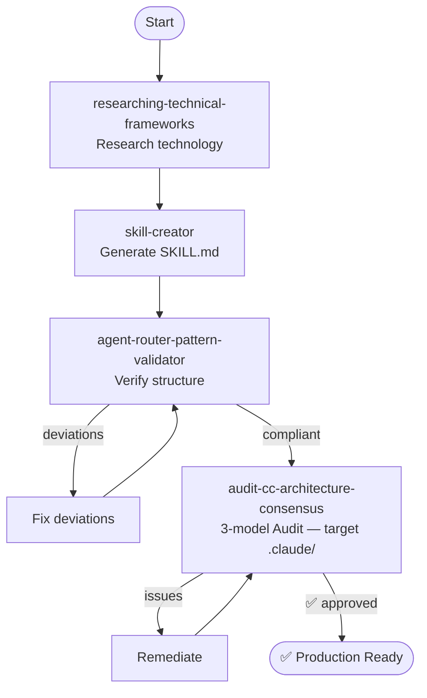

# Flow: Project Creation

Create a production-ready agent project from scratch, from bootstrap to full audit.

---

## Diagram

---

## Detailed Steps

### Step 1: Technology Research

**Prompt**: `/researching-technical-frameworks <tech>`

**What happens**:
- Researches the technology/framework with official sources
- Produces a source-dated research document

**Input**: Technology name and target version
**Output**: Validated research document

**Typical duration**: 5-10 minutes

---

### Step 2: Skill Creation

**Prompt**: `/skill-creator`

**What happens**:
- Transforms the research document into an operational SKILL.md
- Applies Three-Tier patterns (✅⚠️🚫) and Version Absolutism

**Input**: Research document from Step 1
**Output**: SKILL.md ready for use by agents

**Typical duration**: 3-5 minutes

---

### Step 3: Structure Validation

**Prompt**: `/agent-router-pattern-validator`

**What happens**:
- Verifies that the Agent Router Pattern is correct
- Identifies broken references, incorrect naming, dead-ends

**Input**: Generated project directory
**Output**: Report with score + deviations

**If there are deviations**:
1. Read the report
2. Fix each listed deviation
3. Re-run the validator
4. Repeat until score is satisfactory

---

### Step 4: Multi-Model Audit

**Prompt**: `/audit-cc-architecture-consensus` (target `.claude/`)

> For GitHub Copilot projects (`.github/`), use `/audit-architecture-consensus`.

**What happens**:
- Model A verifies the responsibility hierarchy (G0→G4: CLAUDE.md → agents → rules → skills)
- Model B verifies invocation chains (reachability, dead-ends, orphans)
- Model C verifies Claude Code engine mechanics (paths:, disable-model-invocation, context: fork)
- Orchestrator compares and prioritizes by consensus

**Input**: Agent name or path
**Output**: Prioritized report with remediations

**If there are issues**:
1. Focus on 3/3 issues (all models agree) first
2. Then 2/3
3. 1/3 issues may be accepted as risk

---

## Capabilities Involved

| Step | Capability | Type |
|-------|-----------|------|
| 1 | `researching-technical-frameworks` | Research |
| 2 | `skill-creator` | Compilation |
| 3 | `agent-router-pattern-validator` | Framework |
| 4 | `audit-cc-architecture-scope` | CC Audit |
| 4 | `audit-cc-architecture-flow` | CC Audit |
| 4 | `audit-cc-architecture-engine` | CC Audit |
| 4 | `audit-cc-architecture-consensus` | CC Audit |

---

## Prerequisites

- Know which technology/domain the agent will cover
- Have access to `/researching-technical-frameworks` for initial research

## Final Result

Project with:
- ✅ Structure compliant with Agent Router Pattern
- ✅ Correct responsibility hierarchy
- ✅ Complete invocation chains
- ✅ Compliant Claude Code engine mechanics

## Next Steps

After creating the project, the generated skills are placeholders. To populate them:
→ [Knowledge Base Flow](fluxo-base-conhecimento.md)
