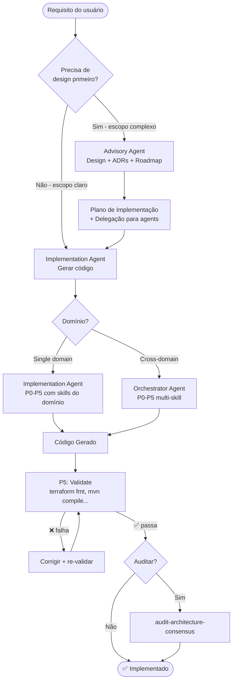
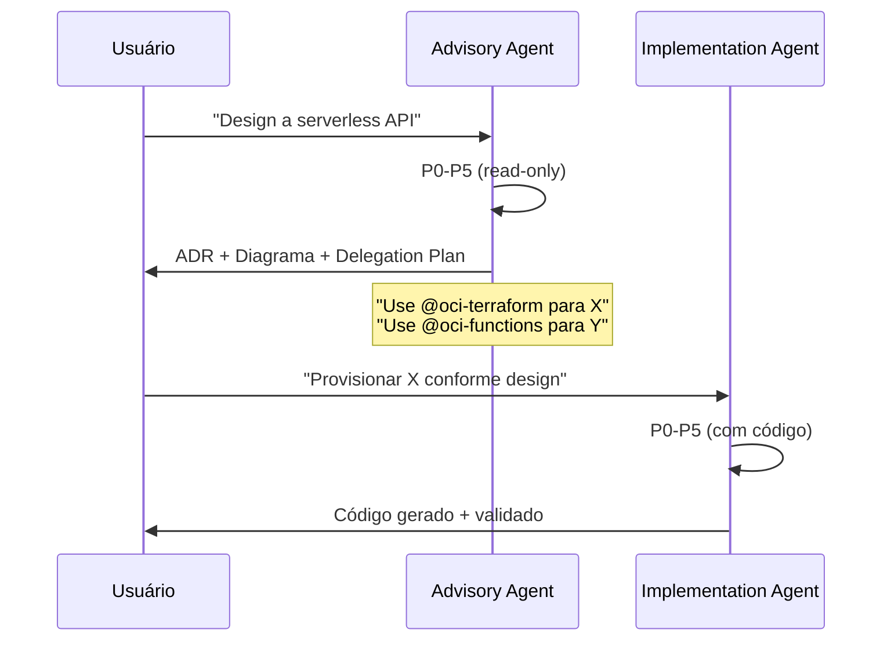
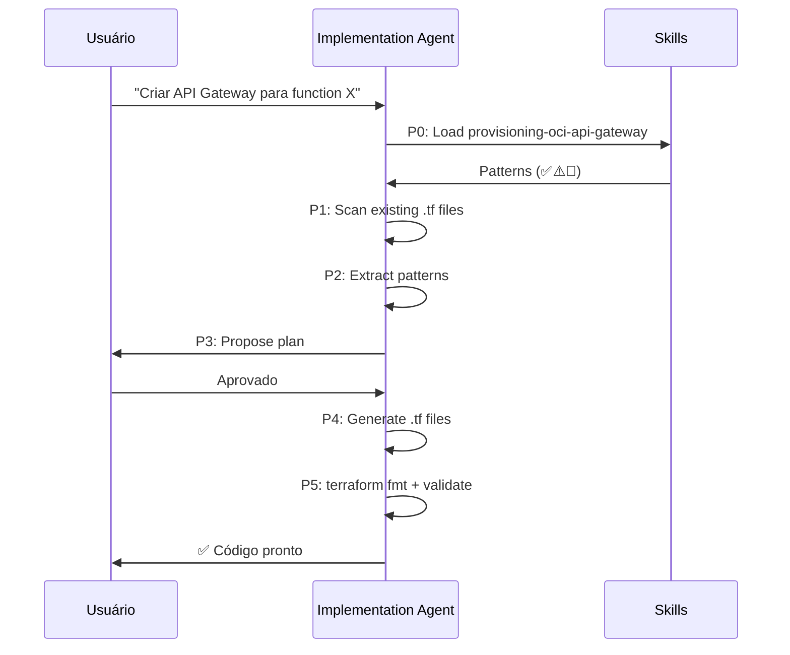
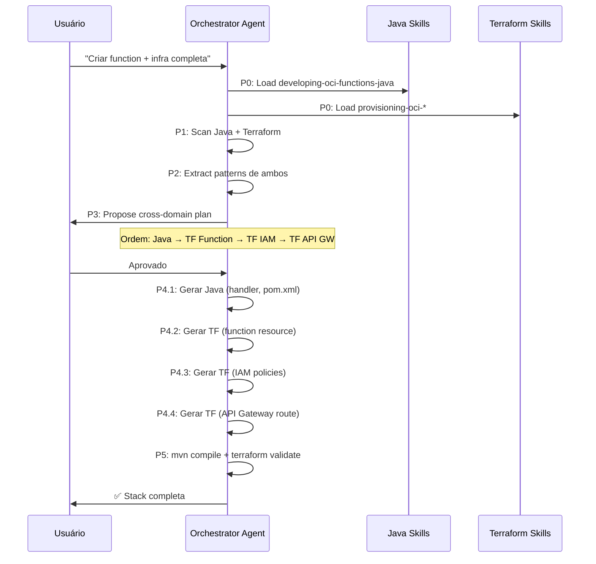
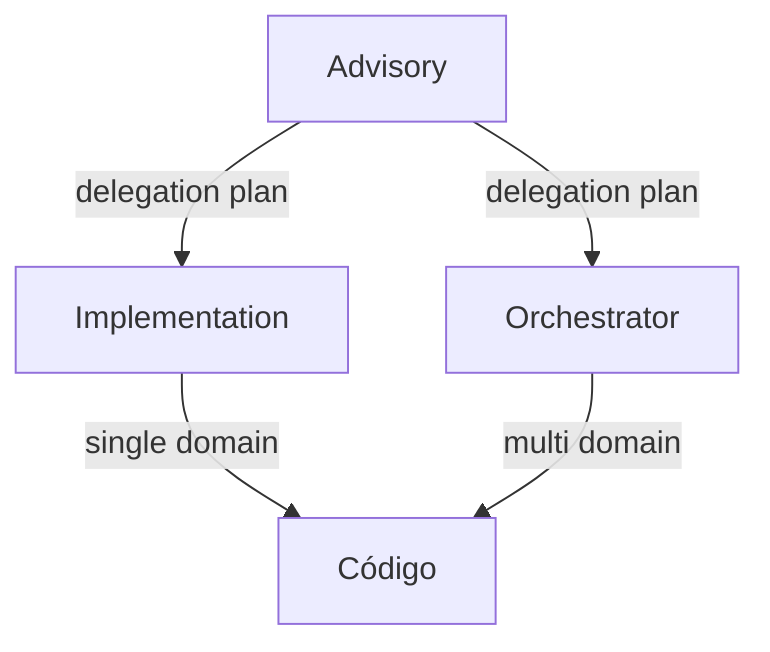

# Fluxo: Implementação

Usar agentes existentes para design + implementação de funcionalidades.

---

## Diagrama



---

## Padrões de Implementação

### Padrão 1: Advisory → Implementation (Design-first)

Para escopos complexos ou quando a arquitetura não está clara.



**Exemplo real**: `oci-serverless-architect` (design) → `oci-terraform` (infraestrutura)

---

### Padrão 2: Implementation Direto (Single domain)

Para escopos claros em um domínio específico.



**Exemplo real**: `oci-terraform` com skill `provisioning-oci-api-gateway`

---

### Padrão 3: Orchestrator (Cross-domain)

Para implementações que envolvem múltiplos domínios técnicos com dependências.



**Exemplo real**: `oci-serverless-stack` (Java + Terraform)

---

## Dependência entre Padrões



| Se o escopo é... | Use |
|-----------------|-----|
| Indefinido (precisa de design) | Advisory → Implementation |
| Claro, um domínio | Implementation direto |
| Claro, múltiplos domínios | Orchestrator direto |
| Complexo, múltiplos domínios | Advisory → Orchestrator |

---

## Capacidades Envolvidas

| Etapa | Tipo de Agente | Skills Consumidas |
|-------|---------------|-------------------|
| Design | Advisory | Skills de arquitetura (designing-*, architecting-*) |
| Implementação single | Implementation | Skills do domínio (provisioning-*, developing-*) |
| Implementação cross | Orchestrator | Skills de múltiplos domínios |
| Validação | (built-in P5) | — |
| Auditoria | audit-architecture-consensus | — |

---

## Ordem de Execução em Cross-Domain

O Orchestrator respeita dependências entre domínios:

```
Layer 1: Networking    (base — sem dependências)
Layer 2: IAM           (depende de networking para compartments)
Layer 3: Core Service  (depende de IAM para policies)
Layer 4: Integration   (depende de service para OCIDs)
```

Cada layer só inicia após a anterior estar completa e validada.

---

## Resultado Final

- **Advisory**: ADRs + diagrama + plano de delegação
- **Implementation**: Código gerado + validado (fmt/compile)
- **Orchestrator**: Stack multi-domínio completa + validada cross-domain
