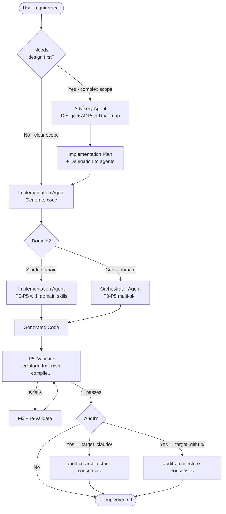
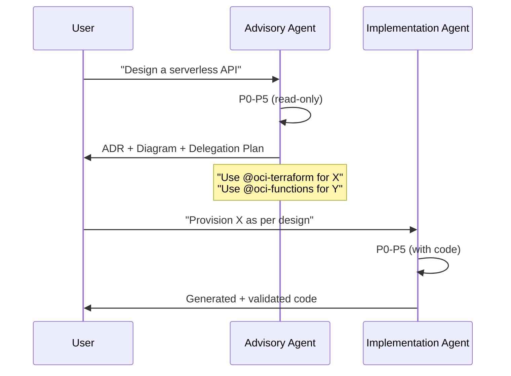
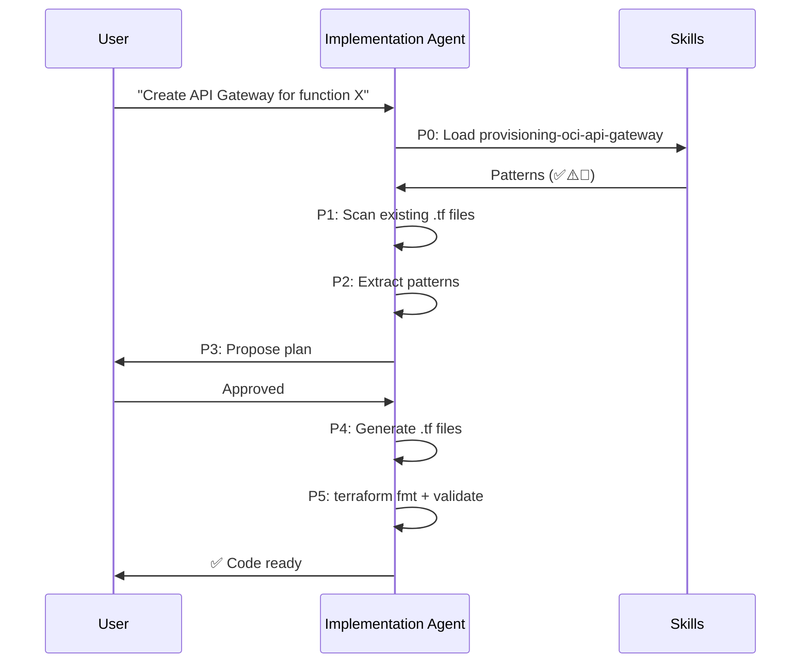
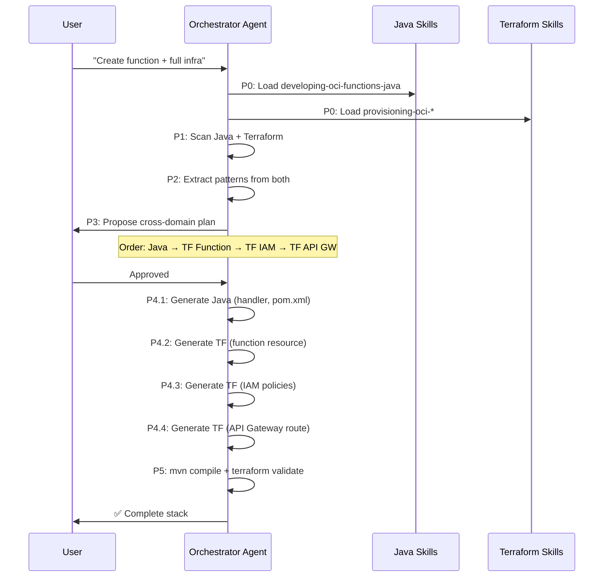
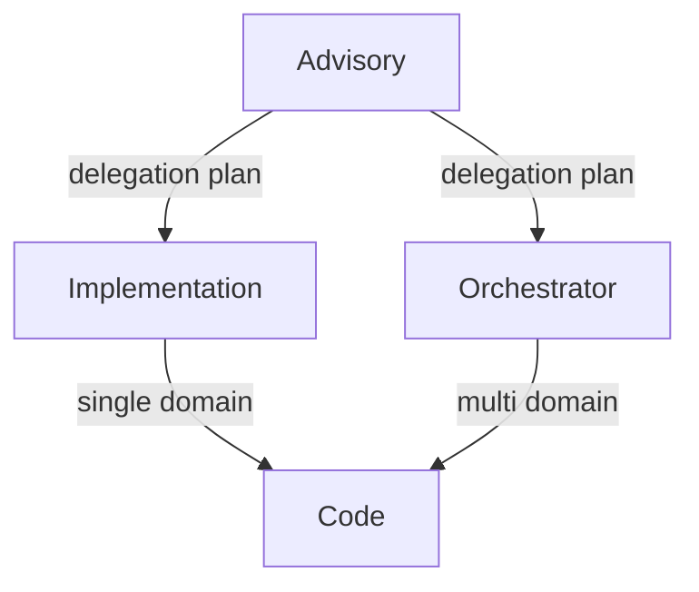

# Flow: Implementation

Use existing agents for feature design + implementation.

---

## Diagram



---

## Implementation Patterns

### Pattern 1: Advisory → Implementation (Design-first)

For complex scopes or when the architecture is not clear.



**Real example**: `oci-serverless-architect` (design) → `oci-terraform` (infrastructure)

---

### Pattern 2: Direct Implementation (Single domain)

For clear scopes in a specific domain.



**Real example**: `oci-terraform` with skill `provisioning-oci-api-gateway`

---

### Pattern 3: Orchestrator (Cross-domain)

For implementations involving multiple technical domains with dependencies.



**Real example**: `oci-serverless-stack` (Java + Terraform)

---

## Dependency Between Patterns



| If the scope is... | Use |
|-----------------|-----|
| Undefined (needs design) | Advisory → Implementation |
| Clear, one domain | Direct Implementation |
| Clear, multiple domains | Direct Orchestrator |
| Complex, multiple domains | Advisory → Orchestrator |

---

## Capabilities Involved

| Step | Agent Type | Skills Used |
|-------|---------------|-------------------|
| Design | Advisory | Architecture skills (designing-*, architecting-*) |
| Single Implementation | Implementation | Domain skills (provisioning-*, developing-*) |
| Cross Implementation | Orchestrator | Skills from multiple domains |
| Validation | (built-in P5) | — |
| CC Audit | `audit-cc-architecture-consensus` (target `.claude/`) | — |
| Copilot Audit | `audit-architecture-consensus` (target `.github/`) | — |

---

## Execution Order in Cross-Domain

The Orchestrator respects dependencies between domains:

```
Layer 1: Networking    (base — no dependencies)
Layer 2: IAM           (depends on networking for compartments)
Layer 3: Core Service  (depends on IAM for policies)
Layer 4: Integration   (depends on service for OCIDs)
```

Each layer only starts after the previous one is complete and validated.

---

## Final Result

- **Advisory**: ADRs + diagram + delegation plan
- **Implementation**: Generated + validated code (fmt/compile)
- **Orchestrator**: Complete multi-domain stack + cross-domain validated

---

> **Audit reference**: For full details on CC vs Copilot variants, consensus criteria, and individual lenses → [architecture-auditor Manual](../manual/architecture-auditor.md)
