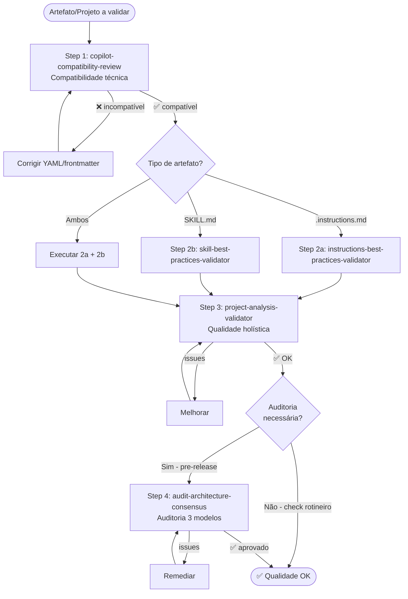

# Fluxo: Qualidade

Pipeline de validação completa para garantir qualidade de artefatos e projetos.

---

## Diagrama

---

## Etapas Detalhadas

### Step 1: Compatibilidade Técnica

**Prompt**: `@workspace /copilot-compatibility-review`

**O que verifica**:
- YAML frontmatter válido
- Campos dentro dos limites (name ≤64, description ≤1024)
- Tools declarados corretamente
- applyTo com globs válidos

**Por que primeiro**: Se o YAML está malformado, o Copilot ignora o arquivo silenciosamente. Nada mais importa se isso falhar.

---

### Step 2: Qualidade de Conteúdo

#### 2a: Instructions
**Prompt**: `@workspace /instructions-best-practices-validator`

**O que verifica**:
- Clareza e concisão
- Escopo adequado
- Sem contradições
- Padrões de naming

#### 2b: Skills
**Prompt**: `@workspace /skill-best-practices-validator`

**O que verifica**:
- Three-tier completo (✅⚠️🚫)
- Código em todos os ✅
- Alternativas em todos os 🚫
- Version absolutism
- Blueprints presentes

---

### Step 3: Qualidade de Projeto

**Prompt**: `@workspace /project-analysis-validator`

**O que verifica**:
- Consistência entre artefatos
- Referências íntegras (nada aponta para inexistente)
- Cobertura de domínio
- Sem componentes órfãos

---

### Step 4 (opcional): Auditoria Arquitetural

**Prompt**: `@workspace /audit-architecture-consensus`

**O que verifica**:
- Hierarquia de responsabilidades (Modelo A)
- Cadeias de invocação (Modelo B)
- Mecânicas VS Code (Modelo C)
- Consenso priorizado

**Quando incluir Step 4**:
- Antes de release/produção
- Após mudanças estruturais significativas
- Quando algo não funciona e Steps 1-3 não acharam

---

## Níveis de Validação

| Cenário | Steps | Tempo estimado |
|---------|:-----:|:-:|
| Quick check (editei 1 arquivo) | 1 | ~1 min |
| Nova skill criada | 1-2b | ~3 min |
| Novas instructions | 1-2a | ~3 min |
| Projeto pós-bootstrap | 1-3 | ~5 min |
| Pre-release completo | 1-4 | ~10 min |

---

## Capacidades Envolvidas

| Step | Capacidade | Foco |
|:----:|-----------|------|
| 1 | `copilot-compatibility-review` | Técnico (YAML, limites) |
| 2a | `instructions-best-practices-validator` | Conteúdo (instructions) |
| 2b | `skill-best-practices-validator` | Conteúdo (skills) |
| 3 | `project-analysis-validator` | Holístico (projeto) |
| 4 | `audit-architecture-consensus` | Arquitetural (3 modelos) |

---

## Checklist Rápido

Antes de commit, pergunte:

- [ ] YAML válido? (Step 1)
- [ ] Conteúdo segue best practices? (Step 2)
- [ ] Projeto é consistente? (Step 3)
- [ ] Arquitetura é sólida? (Step 4 — se aplicável)
