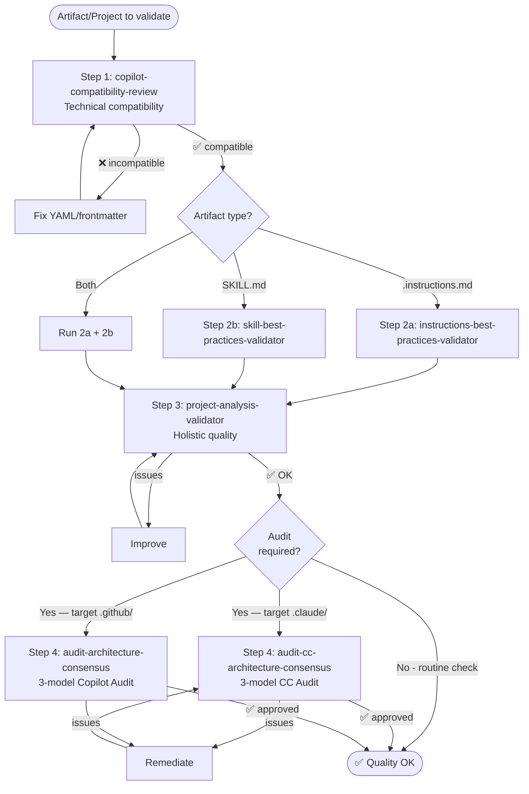

# Flow: Quality

Complete validation pipeline to ensure artifact and project quality.

---

## Diagram

---

## Detailed Steps

### Step 1: Technical Compatibility

**Prompt**: `/copilot-compatibility-review`

**What it checks**:
- Valid YAML frontmatter
- Fields within limits (name ≤64, description ≤1024)
- Tools declared correctly
- applyTo with valid globs

**Why first**: If the YAML is malformed, Copilot silently ignores the file. Nothing else matters if this fails.

---

### Step 2: Content Quality

#### 2a: Instructions
**Prompt**: `/instructions-best-practices-validator`

**What it checks**:
- Clarity and conciseness
- Adequate scope
- No contradictions
- Naming patterns

#### 2b: Skills
**Prompt**: `/skill-best-practices-validator`

**What it checks**:
- Complete Three-Tier (✅⚠️🚫)
- Code in all ✅
- Alternatives in all 🚫
- Version Absolutism
- Blueprints present

---

### Step 3: Project Quality

**Prompt**: `/project-analysis-validator`

**What it checks**:
- Consistency between artifacts
- Intact references (nothing points to non-existent)
- Domain coverage
- No orphan components

---

### Step 4 (optional): Architectural Audit

**Prompt** — choose by target runtime:

| Target | Command |
|------|---------|
| Claude Code project (`.claude/`) | `/audit-cc-architecture-consensus` |
| GitHub Copilot project (`.github/`) | `/audit-architecture-consensus` |

**What it checks**:
- Responsibility hierarchy — Model A (G0→G4 for CC; L0→L4 for Copilot)
- Invocation chains — Model B (reachability, dead-ends, orphans)
- Engine mechanics — Model C (paths:/applyTo, context budget, frontmatter)
- Prioritized consensus: 3/3 🔴 Must-Fix, 2/3 🟡 Should-Fix, 1/3 🟢 Consider

**When to include Step 4**:
- Before release/production
- After significant structural changes
- When something is not working and Steps 1-3 did not find it

---

## Validation Levels

| Scenario | Steps | Estimated time |
|---------|:-----:|:-:|
| Quick check (edited 1 file) | 1 | ~1 min |
| New skill created | 1-2b | ~3 min |
| New instructions | 1-2a | ~3 min |
| Post-bootstrap project | 1-3 | ~5 min |
| Full pre-release | 1-4 | ~10 min |

---

## Capabilities Involved

| Step | Capability | Focus |
|:----:|-----------|------|
| 1 | `copilot-compatibility-review` | Technical (YAML, limits) |
| 2a | `instructions-best-practices-validator` | Content (instructions) |
| 2b | `skill-best-practices-validator` | Content (skills) |
| 3 | `project-analysis-validator` | Holistic (project) |
| 4 | `audit-cc-architecture-consensus` (CC) / `audit-architecture-consensus` (Copilot) | Architectural (3 models) |

---

## Quick Checklist

Before committing, ask:

- [ ] Valid YAML? (Step 1)
- [ ] Content follows best practices? (Step 2)
- [ ] Project is consistent? (Step 3)
- [ ] Architecture is solid? (Step 4 — if applicable)
