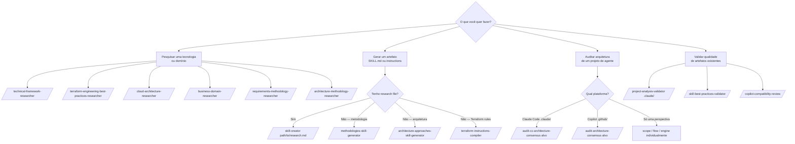

# Manual de Uso dos Agentes — Agents Factory

Referência completa dos 4 subagentes e dos 24 comandos que os invocam.

---

## Navegação por Agente

| Agente | Modelo | Comandos | Arquivo |
|--------|--------|:--------:|---------|
| [framework-researcher](framework-researcher.md) | opus | 7 | Pesquisa de tecnologias, frameworks, domínios, arquiteturas |
| [skill-author](skill-author.md) | sonnet | 4 | Geração de SKILL.md e .instructions.md |
| [architecture-auditor](architecture-auditor.md) | opus | 8 | Auditoria multi-modelo de arquitetura de agentes |
| [quality-validator](quality-validator.md) | sonnet | 5 | Validação de qualidade e conformidade de artefatos |

---

## Quick Reference — Todos os 24 Comandos

### Pesquisa (`framework-researcher`)

```
/technical-framework-researcher              # Pesquisa tecnologia/framework por versão
/technical-framework-researcher-terraform    # Pesquisa serviço cloud + Terraform (IaC)
/cloud-architecture-researcher               # Pesquisa framework cloud (AWS WAF, Azure CAF, OCI)
/business-domain-researcher                  # Pesquisa domínio organizacional (Finance, Legal, HR)
/requirements-methodology-researcher         # Pesquisa framework de requisitos (Scrum, SAFe)
/architecture-methodology-researcher         # Pesquisa metodologia de arquitetura (C4, DDD, TOGAF)
/terraform-engineering-best-practices-researcher  # Pesquisa práticas de engenharia Terraform
```

### Geração (`skill-author`)

```
/skill-creator <caminho-para-research-file>        # Cria SKILL.md de qualquer research file
/methodologies-skill-generator <metodologia>       # Pesquisa + gera skill de metodologia (tudo-em-um)
/architecture-approaches-skill-generator <tema>    # Pesquisa + gera skill de arquitetura (tudo-em-um)
/terraform-instructions-compiler <research-file>   # Gera .instructions.md de pesquisa Terraform
```

### Auditoria — Claude Code (`architecture-auditor`)

```
/audit-cc-architecture-consensus <alvo>    # Auditoria completa 3 lentes em paralelo (recomendado)
/audit-cc-architecture-scope <alvo>        # Lente A: hierarquia de responsabilidades
/audit-cc-architecture-flow <alvo>         # Lente B: cadeias de invocação
/audit-cc-architecture-engine <alvo>       # Lente C: mecânicas do engine CC
```

### Auditoria — Copilot (`architecture-auditor`)

```
/audit-architecture-consensus <alvo>      # Auditoria completa 3 lentes em paralelo
/audit-architecture-scope <alvo>          # Lente A: hierarquia L0→L4
/audit-architecture-flow <alvo>           # Lente B: cadeias de invocação
/audit-architecture-engine <alvo>         # Lente C: mecânicas VS Code engine
```

### Validação (`quality-validator`)

```
/skill-best-practices-validator .claude/skills/        # Valida SKILL.md contra best practices
/instructions-best-practices-validator .claude/rules/  # Valida rules contra best practices
/agent-router-pattern-validator                         # Valida padrão de roteamento do projeto
/copilot-compatibility-review                           # Verifica compatibilidade com docs Copilot
/project-analysis-validator .claude/                   # Análise holística de saúde do projeto
```

---

## Como Escolher o Agente



---

## Fluxo Típico de Ponta-a-Ponta

```
1. /technical-framework-researcher
        │ → research_FastAPI_v0.115.md
        ↓
2. /skill-creator StoryBeat/research_FastAPI_v0.115.md
        │ → .claude/skills/fastapi-async-api/SKILL.md
        ↓
3. /skill-best-practices-validator .claude/skills/fastapi-async-api/
        │ → relatório de qualidade
        ↓
4. /project-analysis-validator .claude/
        │ → .claude/project-analysis-report.md
        ↓
5. /audit-cc-architecture-consensus .claude/
        │ → CC_ARCHITECTURE_MULTI_MODEL_REPORT.md
```

---

## Links para Referência

- [Como Usar → Workflows completos](../como-usar/README.md)
- [Catálogo de Capacidades](../capacidades/README.md)
- [Mapeamento .github/ ↔ .claude/](../referencia/mapeamento-github-claude.md)
- [Convenções e Padrões](../referencia/convencoes.md)
