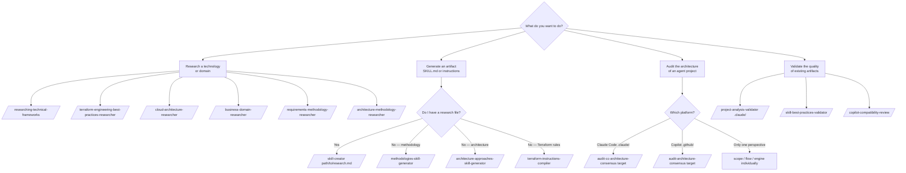

# Agent Usage Manual — Agents Factory

Complete reference for the 5 sub-agents and the 25 commands that invoke them.

---

## Navigation by Agent

| Agent | Model | Commands | File |
|--------|--------|:--------:|---------|
| [framework-researcher](framework-researcher.md) | opus | 7 | Research on technologies, frameworks, domains, architectures |
| [skill-author](skill-author.md) | sonnet | 4 | Generation of SKILL.md and .instructions.md |
| [architecture-auditor](architecture-auditor.md) | opus | 8 | Multi-model audit of agent architecture |
| [quality-validator](quality-validator.md) | sonnet | 5 | Quality and compliance validation of artifacts |
| [skill-evaluator](skill-evaluator.md) | sonnet | 1 | Behavioral evaluation of skills via LLM-as-judge |

---

## Quick Reference — All 25 Commands

### Research (`framework-researcher`)

```
/researching-technical-frameworks            # Research technology/framework by version
/technical-framework-researcher-terraform    # Research cloud service + Terraform (IaC)
/cloud-architecture-researcher               # Research cloud framework (AWS WAF, Azure CAF, OCI)
/business-domain-researcher                  # Research organizational domain (Finance, Legal, HR)
/requirements-methodology-researcher         # Research requirements framework (Scrum, SAFe)
/architecture-methodology-researcher         # Research architecture methodology (C4, DDD, TOGAF)
/terraform-engineering-best-practices-researcher  # Research Terraform engineering practices
```

### Generation (`skill-author`)

```
/skill-creator <path-to-research-file>             # Creates SKILL.md from any research file
/methodologies-skill-generator <methodology>       # Research + generates methodology skill (all-in-one)
/architecture-approaches-skill-generator <topic>   # Research + generates architecture skill (all-in-one)
/terraform-instructions-compiler <research-file>   # Generates .instructions.md from Terraform research
```

### Audit — Claude Code (`architecture-auditor`)

```
/audit-cc-architecture-consensus <target>    # Full audit 3 lenses in parallel (recommended)
/audit-cc-architecture-scope <target>        # Lens A: responsibility hierarchy
/audit-cc-architecture-flow <target>         # Lens B: invocation chains
/audit-cc-architecture-engine <target>       # Lens C: CC engine mechanics
```

### Audit — Copilot (`architecture-auditor`)

```
/audit-architecture-consensus <target>      # Full audit 3 lenses in parallel
/audit-architecture-scope <target>          # Lens A: L0→L4 hierarchy
/audit-architecture-flow <target>           # Lens B: invocation chains
/audit-architecture-engine <target>         # Lens C: VS Code engine mechanics
```

### Validation (`quality-validator`)

```
/skill-best-practices-validator .claude/skills/        # Validates SKILL.md against best practices
/instructions-best-practices-validator .claude/rules/  # Validates rules against best practices
/agent-router-pattern-validator                         # Validates project routing pattern
/copilot-compatibility-review                           # Checks Copilot documentation compatibility
/project-analysis-validator .claude/                   # Holistic project health analysis
```

### Evaluation (`skill-evaluator`)

```
/evaluating-skill-scenarios <skill-name>            # Runs LLM-as-judge scenarios for the skill
```

---

## How to Choose the Agent



---

## Typical End-to-End Flow

```
1. /researching-technical-frameworks
        │ → research_FastAPI_v0.115.md
        ↓
2. /skill-creator StoryBeat/research_FastAPI_v0.115.md
        │ → .claude/skills/fastapi-async-api/SKILL.md
        ↓
3. /skill-best-practices-validator .claude/skills/fastapi-async-api/
        │ → quality report
        ↓
4. /project-analysis-validator .claude/
        │ → .claude/project-analysis-report.md
        ↓
5. /audit-cc-architecture-consensus .claude/
        │ → CC_ARCHITECTURE_MULTI_MODEL_REPORT.md
```

---

## Reference Links

- [How to Use → Complete workflows](../como-usar/README.md)
- [Capabilities Catalog](../capacidades/README.md)
- [Mapping .github/ ↔ .claude/](../referencia/mapeamento-github-claude.md)
- [Conventions and Standards](../referencia/convencoes.md)
