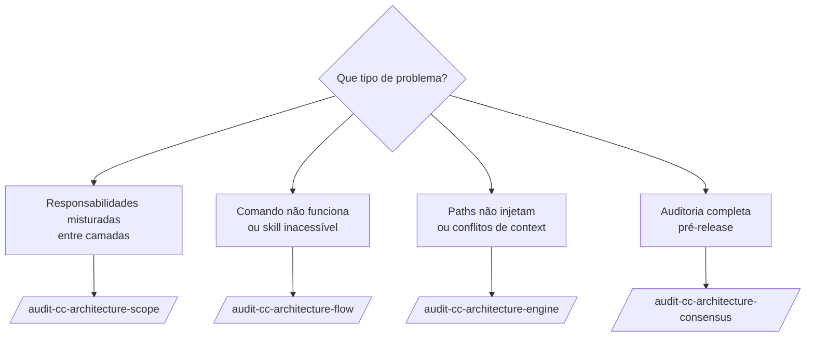

# Agente: architecture-auditor

> **Modelo:** `opus` | **Tools:** Read, Grep, Glob, Agent, Write
> **Papel:** Auditor de Arquitetura — verifica conformidade de projetos de agente em três perspectivas independentes (Scope, Flow, Engine) e consolida findings em um relatório de consenso com scoring e remediação priorizada.

**O que faz:** Analisa projetos Claude Code (`.claude/`) ou GitHub Copilot (`.github/`) contra critérios formais de arquitetura. Usa a ferramenta `Agent` para orquestrar 3 lentes em paralelo no modo consensus.

**O que NÃO faz:** Pesquisar tecnologias, gerar SKILL.md, validar qualidade de skill individual ou modificar arquivos auditados.

**Importante:** O agente usa `ls`, `wc` e `grep` para contar artefatos — nunca confia em contagens reportadas no CLAUDE.md sem verificar.

---

## Escolhendo a Variante Certa

| Situação | Use |
|----------|-----|
| Projeto **Claude Code** (`.claude/`) — auditoria completa | `/audit-cc-architecture-consensus` |
| Projeto **Copilot** (`.github/`) — auditoria completa | `/audit-architecture-consensus` |
| Verificar só separação de responsabilidades (CC) | `/audit-cc-architecture-scope` |
| Verificar só cadeias de invocação (CC) | `/audit-cc-architecture-flow` |
| Verificar só mecânicas do engine CC | `/audit-cc-architecture-engine` |
| Debug: "por que minha skill não carrega?" | `/audit-cc-architecture-flow` + `/audit-cc-architecture-engine` |
| Auditoria rápida após refatoração (CC) | `/audit-cc-architecture-scope` |
| Após adicionar novos comandos (CC) | `/audit-cc-architecture-flow` |
| Após mudar `paths:` rules (CC) | `/audit-cc-architecture-engine` |

---

## Família Claude Code (alvo `.claude/`)

### /audit-cc-architecture-consensus

> **Agente:** `architecture-auditor` | **Contexto:** fork | **Modelo invocation:** desabilitado

#### Quando Usar

Use para auditoria completa de um projeto Claude Code antes de publicar, após migração, ou quando suspeitar de drift entre documentação e implementação. É o comando mais abrangente — executa as 3 lentes em paralelo e consolida findings com pesos de consenso.

**Palavras-gatilho:** "auditoria completa", "consensus audit", "multi-model", "validação de arquitetura completa", "production readiness check".

#### Pré-condições

- Projeto Claude Code com `.claude/agents/`, `.claude/skills/`, `.claude/rules/`, `CLAUDE.md`
- Se o projeto estiver incompleto, o agente reporta os elementos faltantes na seção Executive Summary

#### Inputs

| Campo | Obrigatório | Exemplo |
|-------|:-----------:|---------|
| `$ARGUMENTS` — alvo | ✅ | Nome do agente (`framework-researcher`) ou caminho (`.claude/`) |

#### Exemplo de Chamada

```
/audit-cc-architecture-consensus .claude/
```

ou para auditar um agente específico:

```
/audit-cc-architecture-consensus framework-researcher
```

#### Como Funciona Internamente

O `architecture-auditor` usa a ferramenta `Agent` para spawnar **3 sub-agentes em paralelo** (fan-out depth = 1, nunca mais fundo):

```
audit-cc-architecture-consensus
    ├──[parallel]── audit-cc-architecture-scope  (Lente A)
    ├──[parallel]── audit-cc-architecture-flow   (Lente B)
    └──[parallel]── audit-cc-architecture-engine (Lente C)
                              │
                    coleta findings dos 3
                              │
                    gera matriz de concordância
                              │
                    CC_ARCHITECTURE_MULTI_MODEL_REPORT.md
```

**Critérios de consenso:**
- **3/3 lentes concordam** → 🔴 Must-Fix (bloqueante)
- **2/3 concordam** → 🟡 Should-Fix (importante)
- **1/3 apenas** → 🟢 Consider (informativo)

#### Output Produzido

```
CC_ARCHITECTURE_MULTI_MODEL_REPORT.md
```

Estrutura do relatório (8 seções):

```markdown
# CC Architecture Multi-Model Audit Report

## 1. Executive Summary
Consensus Verdict: ✅ PASS / ⚠️ CONDITIONAL / ❌ FAIL
Score table: Lente A | Lente B | Lente C | Consensus

## 2. Consensus Findings (3/3) 🔴 MUST FIX
## 3. Two-Model Findings (2/3) 🟡 SHOULD FIX
## 4. Single-Model Findings 🟢 CONSIDER
## 5. Per-Model Detailed Results
## 6. Unified Remediation Roadmap
## 7. Model Effectiveness Analysis
## 8. Conclusion
```

**Veredicto:**

| Veredicto | Condição |
|-----------|----------|
| ✅ PASS | Todas as 3 lentes ≥ 7.0, zero findings 🔴 |
| ⚠️ CONDITIONAL | Qualquer lente entre 5.0–6.9, ou 1–2 findings 🔴 |
| ❌ FAIL | Qualquer lente < 5.0, ou ≥ 3 findings 🔴 |

#### Verificação do Report

```bash
ls -lh CC_ARCHITECTURE_MULTI_MODEL_REPORT.md         # arquivo existe, tamanho > 0
grep -c "Model A\|Model B\|Model C" CC_ARCHITECTURE_MULTI_MODEL_REPORT.md    # >= 3
grep -n "MUST FIX\|SHOULD FIX\|CONSIDER" CC_ARCHITECTURE_MULTI_MODEL_REPORT.md
grep "Remediation Roadmap" CC_ARCHITECTURE_MULTI_MODEL_REPORT.md             # existe
```

#### Nunca Fazer

- Invocar `audit-cc-architecture-consensus` de dentro de outra execução de consensus (ciclo infinito)
- Médiar os 3 scores como "score geral" — scores são independentes por perspectiva
- Saltar uma lente por "já ter issues suficientes" — as 3 são obrigatórias
- Modificar arquivos auditados sem instrução explícita do usuário

---

### /audit-cc-architecture-scope (Lente A)

> **Agente:** `architecture-auditor` | **Contexto:** fork | **Modelo invocation:** desabilitado

#### Quando Usar

Use para verificar especificamente se as responsabilidades estão bem distribuídas entre as camadas do projeto Claude Code, sem analisar flow ou engine.

**Palavras-gatilho:** "verificar separação de responsabilidades", "scope hierarchy", "vazamento de responsabilidade", "camadas de arquitetura CC".

#### O que Verifica

| Camada | Responsabilidade | Violação típica detectada |
|--------|-----------------|--------------------------|
| **G0** | CLAUDE.md — manifesto global | Lógica de domínio no CLAUDE.md |
| **G1** | Subagentes — personas de execução | Agente com knowledge hardcoded em vez de skill |
| **G2** | Rules — contexto automático por escopo | Rule cobrindo escopo demais (paths: muito amplo) |
| **G3** | Command skills — entry points | Skill de comando com lógica de implementação inline |
| **G4** | Meta-skills — bases de conhecimento | Meta-skill chamando outra meta-skill em loop |

**Score:** G0(5%) + G1(20%) + G2(20%) + G3(20%) + G4(30%) + G-perm(5%)

#### Exemplo de Chamada

```
/audit-cc-architecture-scope framework-researcher
```

#### Output Produzido

```
CC_SCOPE_AUDIT_REPORT.md
```

Score por camada, lista de vazamentos detectados, sugestões de reorganização.

---

### /audit-cc-architecture-flow (Lente B)

> **Agente:** `architecture-auditor` | **Contexto:** fork | **Modelo invocation:** desabilitado

#### Quando Usar

Use para verificar se todos os comandos têm cadeias de invocação completas e se não existem componentes órfãos ou dead-ends.

**Palavras-gatilho:** "verificar cadeias de invocação", "dead-ends", "orphan skills", "reachability", "comando não funciona".

#### O que Verifica (FCC.1–FCC.20)

- **Reachability**: todo componente é alcançável por algum `/comando`
- **Completude**: `/comando → subagente → skill` — nenhum elo faltando
- **Dead-ends**: `agent: x` mas `.claude/agents/x.md` não existe
- **Órfãos**: skill com `context: fork` mas sem nenhum comando apontando para ela
- **Ciclos**: dependências circulares entre componentes
- **Routing**: CLAUDE.md routing table bate com os `agent:` fields das skills

**Score:** Commands(25%) + Subagent(30%) + Rules(20%) + Skills(25%)

#### Exemplo de Chamada

```
/audit-cc-architecture-flow .claude/
```

#### Output Produzido

```
CC_FLOW_AUDIT_REPORT.md
```

Grafo de invocação textual, lista de broken chains, lista de componentes órfãos, sugestões de ligação.

---

### /audit-cc-architecture-engine (Lente C)

> **Agente:** `architecture-auditor` | **Contexto:** fork | **Modelo invocation:** desabilitado

#### Quando Usar

Use para verificar as mecânicas técnicas do Claude Code engine — como as regras são injetadas, budget de skills no contexto, deduplicação de frontmatter, conflitos de instrução.

**Palavras-gatilho:** "paths não está funcionando", "skill não carrega", "context budget", "frontmatter inválido", "conflito de instruções", "active vs passive paths".

#### O que Verifica (ECC.1–ECC.18)

- **`paths:` globs**: sintaxe correta, não muito amplo, não ausente em rules
- **Budget de auto-listing**: skills sem `disable-model-invocation: true` consomem budget automaticamente — verificar quantas há
- **`context: fork` + `agent:`**: todos os command skills têm ambos os campos
- **`allowed-tools:` vs `tools:`**: skills usam `allowed-tools:`, agentes usam `tools:` — nunca trocados
- **Deduplicação**: mesmo conteúdo não injetado em múltiplas rules
- **Conflitos**: instructions contraditórias no mesmo escopo de `paths:`
- **Frontmatter válido**: YAML, campos obrigatórios, modelos válidos

**Score:** paths(25%) + Budget(25%) + Fork/Disclosure(20%) + Conflicts(15%) + Frontmatter/Governance(15%)

#### Exemplo de Chamada

```
/audit-cc-architecture-engine .claude/
```

#### Output Produzido

```
CC_ENGINE_AUDIT_REPORT.md
```

Mapa de loading, warnings de context pollution, conflitos com sugestão de resolução.

---

## Família Copilot (alvo `.github/`)

Os quatro comandos Copilot têm a mesma lógica mas auditam projetos GitHub Copilot (`.github/`), usando critérios do VS Code engine em vez do CC engine.

| Comando | Equivalente CC | Diferença principal |
|---------|---------------|---------------------|
| `/audit-architecture-consensus` | `/audit-cc-architecture-consensus` | Alvo `.github/`, critérios L0→L4 |
| `/audit-architecture-scope` | `/audit-cc-architecture-scope` | Hierarquia L0(settings)→L4(prompts) |
| `/audit-architecture-flow` | `/audit-cc-architecture-flow` | Fluxo `prompt→agent→instructions→skills` |
| `/audit-architecture-engine` | `/audit-cc-architecture-engine` | `applyTo:` globs, context budget VS Code |

### Exemplo de Chamada (Copilot)

```
/audit-architecture-consensus oci-terraform
```

#### Output Produzido

```
AGENT_ARCHITECTURE_MULTI_MODEL_REPORT.md
```

Mesma estrutura de 8 seções, com terminologia Copilot (L0–L4, `applyTo`, `.instructions.md`).

---

## Lentes Individuais: Quando Usar



---

## Princípios do Agente

**Anti-pattern guard:** Nunca confia em contagens reportadas — sempre verifica com `ls`, `wc`, `grep`.

**Consensus integrity:** Findings de lentes únicas não são descartados; são reportados como 🟢 Consider com explicação de por que as outras lentes não detectaram.

**Read-only por padrão:** O agente produz relatórios e recomendações. Nunca modifica arquivos auditados salvo instrução explícita com `--fix`.

---

*Ver [README do manual](README.md) para navegação geral.*
