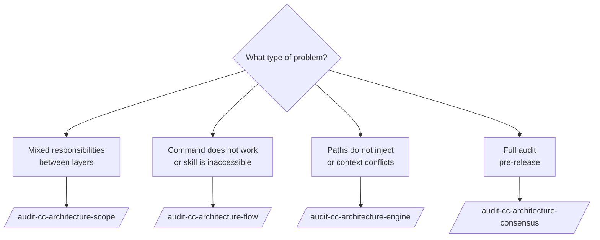

# Agent: architecture-auditor

> **Model:** `opus` | **Tools:** Read, Grep, Glob, Agent, Write
> **Role:** Architecture Auditor — verifies conformance of agent projects across three independent perspectives (Scope, Flow, Engine) and consolidates findings into a consensus report with scoring and prioritized remediation.

**What it does:** Analyzes Claude Code (`.claude/`) or GitHub Copilot (`.github/`) projects against formal architecture criteria. Uses the `Agent` tool to orchestrate 3 lenses in parallel in consensus mode.

**What it does NOT do:** Research technologies, generate SKILL.md, validate quality of individual skills or modify audited files.

**Important:** The agent uses `ls`, `wc` and `grep` to count artifacts — never trusts counts reported in CLAUDE.md without verifying.

---

## Choosing the Right Variant

| Situation | Use |
|----------|-----|
| **Claude Code** project (`.claude/`) — full audit | `/audit-cc-architecture-consensus` |
| **Copilot** project (`.github/`) — full audit | `/audit-architecture-consensus` |
| Check only responsibility separation (CC) | `/audit-cc-architecture-scope` |
| Check only invocation chains (CC) | `/audit-cc-architecture-flow` |
| Check only CC engine mechanics | `/audit-cc-architecture-engine` |
| Debug: "why isn't my skill loading?" | `/audit-cc-architecture-flow` + `/audit-cc-architecture-engine` |
| Quick audit after refactoring (CC) | `/audit-cc-architecture-scope` |
| After adding new commands (CC) | `/audit-cc-architecture-flow` |
| After changing `paths:` rules (CC) | `/audit-cc-architecture-engine` |

---

## Claude Code Family (target `.claude/`)

### /audit-cc-architecture-consensus

> **Agent:** `architecture-auditor` | **Context:** fork | **Model invocation:** disabled

#### When to Use

Use for a full audit of a Claude Code project before publishing, after migration, or when suspecting drift between documentation and implementation. It is the most comprehensive command — runs the 3 lenses in parallel and consolidates findings with consensus weights.

**Trigger words:** "full audit", "consensus audit", "multi-model", "full architecture validation", "production readiness check".

#### Prerequisites

- Claude Code project with `.claude/agents/`, `.claude/skills/`, `.claude/rules/`, `CLAUDE.md`
- If the project is incomplete, the agent reports the missing elements in the Executive Summary section

#### Inputs

| Field | Required | Example |
|-------|:-----------:|---------|
| `$ARGUMENTS` — target | ✅ | Agent name (`framework-researcher`) or path (`.claude/`) |

#### Call Example

```
/audit-cc-architecture-consensus .claude/
```

or to audit a specific agent:

```
/audit-cc-architecture-consensus framework-researcher
```

#### How It Works Internally

The `architecture-auditor` uses the `Agent` tool to spawn **3 sub-agents in parallel** (fan-out depth = 1, never deeper):

```
audit-cc-architecture-consensus
    ├──[parallel]── audit-cc-architecture-scope  (Lens A)
    ├──[parallel]── audit-cc-architecture-flow   (Lens B)
    └──[parallel]── audit-cc-architecture-engine (Lens C)
                              │
                    collects findings from all 3
                              │
                    generates agreement matrix
                              │
                    CC_ARCHITECTURE_MULTI_MODEL_REPORT.md
```

**Consensus criteria:**
- **3/3 lenses agree** → 🔴 Must-Fix (blocking)
- **2/3 agree** → 🟡 Should-Fix (important)
- **1/3 only** → 🟢 Consider (informational)

#### Output Produced

```
CC_ARCHITECTURE_MULTI_MODEL_REPORT.md
```

Report structure (8 sections):

```markdown
# CC Architecture Multi-Model Audit Report

## 1. Executive Summary
Consensus Verdict: ✅ PASS / ⚠️ CONDITIONAL / ❌ FAIL
Score table: Lens A | Lens B | Lens C | Consensus

## 2. Consensus Findings (3/3) 🔴 MUST FIX
## 3. Two-Model Findings (2/3) 🟡 SHOULD FIX
## 4. Single-Model Findings 🟢 CONSIDER
## 5. Per-Model Detailed Results
## 6. Unified Remediation Roadmap
## 7. Model Effectiveness Analysis
## 8. Conclusion
```

**Verdict:**

| Verdict | Condition |
|-----------|----------|
| ✅ PASS | All 3 lenses ≥ 7.0, zero 🔴 findings |
| ⚠️ CONDITIONAL | Any lens between 5.0–6.9, or 1–2 🔴 findings |
| ❌ FAIL | Any lens < 5.0, or ≥ 3 🔴 findings |

#### Report Verification

```bash
ls -lh CC_ARCHITECTURE_MULTI_MODEL_REPORT.md         # file exists, size > 0
grep -c "Model A\|Model B\|Model C" CC_ARCHITECTURE_MULTI_MODEL_REPORT.md    # >= 3
grep -n "MUST FIX\|SHOULD FIX\|CONSIDER" CC_ARCHITECTURE_MULTI_MODEL_REPORT.md
grep "Remediation Roadmap" CC_ARCHITECTURE_MULTI_MODEL_REPORT.md             # exists
```

#### Never Do

- Invoke `audit-cc-architecture-consensus` from within another consensus run (infinite loop)
- Average the 3 scores as an "overall score" — scores are independent by perspective
- Skip a lens because "there are already enough issues" — all 3 are mandatory
- Modify audited files without explicit user instruction

---

### /audit-cc-architecture-scope (Lens A)

> **Agent:** `architecture-auditor` | **Context:** fork | **Model invocation:** disabled

#### When to Use

Use to specifically verify whether responsibilities are well distributed across the Claude Code project layers, without analyzing flow or engine.

**Trigger words:** "check responsibility separation", "scope hierarchy", "responsibility leakage", "CC architecture layers".

#### What It Verifies

| Layer | Responsibility | Typical detected violation |
|--------|-----------------|--------------------------|
| **G0** | CLAUDE.md — global manifest | Domain logic in CLAUDE.md |
| **G1** | Sub-agents — execution personas | Agent with hardcoded knowledge instead of skill |
| **G2** | Rules — automatic context by scope | Rule covering too wide a scope (paths: too broad) |
| **G3** | Command skills — entry points | Command skill with inline implementation logic |
| **G4** | Meta-skills — knowledge bases | Meta-skill calling another meta-skill in a loop |

**Score:** G0(5%) + G1(20%) + G2(20%) + G3(20%) + G4(30%) + G-perm(5%)

#### Call Example

```
/audit-cc-architecture-scope framework-researcher
```

#### Output Produced

```
CC_SCOPE_AUDIT_REPORT.md
```

Score per layer, list of detected leakages, reorganization suggestions.

---

### /audit-cc-architecture-flow (Lens B)

> **Agent:** `architecture-auditor` | **Context:** fork | **Model invocation:** disabled

#### When to Use

Use to verify whether all commands have complete invocation chains and whether there are no orphan components or dead-ends.

**Trigger words:** "check invocation chains", "dead-ends", "orphan skills", "reachability", "command does not work".

#### What It Verifies (FCC.1–FCC.20)

- **Reachability**: every component is reachable via some `/command`
- **Completeness**: `/command → sub-agent → skill` — no missing link
- **Dead-ends**: `agent: x` but `.claude/agents/x.md` does not exist
- **Orphans**: skill with `context: fork` but no command pointing to it
- **Cycles**: circular dependencies between components
- **Routing**: CLAUDE.md routing table matches the `agent:` fields of skills

**Score:** Commands(25%) + Subagent(30%) + Rules(20%) + Skills(25%)

#### Call Example

```
/audit-cc-architecture-flow .claude/
```

#### Output Produced

```
CC_FLOW_AUDIT_REPORT.md
```

Textual invocation graph, list of broken chains, list of orphan components, linking suggestions.

---

### /audit-cc-architecture-engine (Lens C)

> **Agent:** `architecture-auditor` | **Context:** fork | **Model invocation:** disabled

#### When to Use

Use to verify the technical mechanics of the Claude Code engine — how rules are injected, skill budget in context, frontmatter deduplication, instruction conflicts.

**Trigger words:** "paths is not working", "skill does not load", "context budget", "invalid frontmatter", "instruction conflict", "active vs passive paths".

#### What It Verifies (ECC.1–ECC.18)

- **`paths:` globs**: correct syntax, not too broad, not absent in rules
- **Auto-listing budget**: skills without `disable-model-invocation: true` consume budget automatically — check how many there are
- **`context: fork` + `agent:`**: all command skills have both fields
- **`allowed-tools:` vs `tools:`**: skills use `allowed-tools:`, agents use `tools:` — never swapped
- **Deduplication**: same content not injected into multiple rules
- **Conflicts**: contradictory instructions in the same `paths:` scope
- **Valid frontmatter**: YAML, required fields, valid models

**Score:** paths(25%) + Budget(25%) + Fork/Disclosure(20%) + Conflicts(15%) + Frontmatter/Governance(15%)

#### Call Example

```
/audit-cc-architecture-engine .claude/
```

#### Output Produced

```
CC_ENGINE_AUDIT_REPORT.md
```

Loading map, context pollution warnings, conflicts with resolution suggestion.

---

## Copilot Family (target `.github/`)

The four Copilot commands have the same logic but audit GitHub Copilot (`.github/`) projects, using VS Code engine criteria instead of CC engine criteria.

| Command | CC Equivalent | Main difference |
|---------|---------------|---------------------|
| `/audit-architecture-consensus` | `/audit-cc-architecture-consensus` | Target `.github/`, L0→L4 criteria |
| `/audit-architecture-scope` | `/audit-cc-architecture-scope` | L0(settings)→L4(prompts) hierarchy |
| `/audit-architecture-flow` | `/audit-cc-architecture-flow` | Flow `prompt→agent→instructions→skills` |
| `/audit-architecture-engine` | `/audit-cc-architecture-engine` | `applyTo:` globs, VS Code context budget |

### Call Example (Copilot)

```
/audit-architecture-consensus oci-terraform
```

#### Output Produced

```
AGENT_ARCHITECTURE_MULTI_MODEL_REPORT.md
```

Same 8-section structure, with Copilot terminology (L0–L4, `applyTo`, `.instructions.md`).

---

## Individual Lenses: When to Use



---

## Agent Principles

**Anti-pattern guard:** Never trusts reported counts — always verifies with `ls`, `wc`, `grep`.

**Consensus integrity:** Single-lens findings are not discarded; they are reported as 🟢 Consider with an explanation of why the other lenses did not detect them.

**Read-only by default:** The agent produces reports and recommendations. Never modifies audited files unless explicitly instructed with `--fix`.

---

*See [manual README](README.md) for general navigation.*
