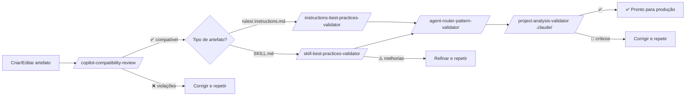

# Agente: quality-validator

> **Modelo:** `sonnet` | **Tools:** Read, Grep, Glob, Write
> **Papel:** Quality & Best-Practices Validator — analisa artefatos existentes contra documentação oficial e convenções do time, emite relatório de qualidade graduado e priorizado.

**O que faz:** Lê artefatos (SKILL.md, rules, prompts, projeto inteiro), compara com checklist de best practices, gradua cada dimensão com ✅ pass / ⚠️ improve / 🚫 violation e sugere correções concretas.

**O que NÃO faz:** Pesquisar tecnologias, gerar novos artefatos, auditar arquitetura multi-modelo, ou reescrever silenciosamente arquivos auditados (read-only por padrão).

**Verificação objetiva:** Usa `grep`, `wc`, `ls` para confirmar contagens — nunca confia em valores declarados sem verificar.

---

## Ordem Recomendada de Validação

Execute nesta sequência para cobertura crescente:

```
1. /copilot-compatibility-review          ← compatibilidade técnica primeiro
        ↓ se OK
2. /instructions-best-practices-validator ← qualidade de rules
   /skill-best-practices-validator        ← qualidade de skills
        ↓ se OK
3. /agent-router-pattern-validator        ← consistência de roteamento
        ↓ se OK
4. /project-analysis-validator .claude/   ← saúde holística
```

---

## /project-analysis-validator

> **Agente:** `quality-validator` | **Contexto:** fork | **Modelo invocation:** desabilitado

### Quando Usar

Use para uma análise holística de um projeto de agente Claude Code completo — verifica estrutura de diretórios, precisão do CLAUDE.md, frontmatter de todos os artefatos, consistência de roteamento, naming conventions, progressive disclosure e cobertura de rules.

**Palavras-gatilho:** "saúde do projeto", "auditar projeto completo", "verificar CLAUDE.md", "project health check", "pre-release validation", "drift entre docs e implementação".

### Pré-condições

- Projeto Claude Code com estrutura básica: `.claude/agents/`, `.claude/skills/`, `.claude/rules/`, `CLAUDE.md`

### Inputs

| Campo | Obrigatório | Exemplo |
|-------|:-----------:|---------|
| Caminho do projeto | ✅ | `.claude/` (padrão) |

### Exemplo de Chamada

```
/project-analysis-validator .claude/
```

### 7 Dimensões de Validação

| # | Dimensão | O que Verifica |
|---|----------|----------------|
| P1 | Estrutura de diretórios | `.claude/agents/`, `.claude/skills/`, `.claude/rules/` existem; `CLAUDE.md` presente |
| P2 | Precisão do CLAUDE.md | Contagens de skills/agentes/comandos conferem com o disco; routing table cobre todas as `context: fork` skills |
| P3 | Frontmatter | Campos obrigatórios presentes e válidos; `allowed-tools:` nas skills, `tools:` nos agentes |
| P4 | Consistência do Router | Cada `context: fork` skill tem `agent:` apontando para agente que existe em `.claude/agents/` |
| P5 | Naming Conventions | Nome da pasta = campo `name:` do frontmatter; todos kebab-case |
| P6 | Progressive Disclosure | SKILL.md < 500 linhas; blueprints usados para conteúdo extenso |
| P7 | Cobertura de Rules | Ao menos um `.claude/rules/*.md` cobre convenções de frontmatter |

### 9 Anti-Padrões Detectados

| Anti-Padrão | Descrição |
|------------|-----------|
| Orphan fork | `context: fork` sem campo `agent:` |
| Broken agent ref | `agent: foo` mas `.claude/agents/foo.md` não existe |
| Missing `disable-model-invocation` | Command skill sem essa flag consome budget de auto-listing |
| `tools:` em skill | Deve ser `allowed-tools:` |
| `allowed-tools:` em agente | Deve ser `tools:` |
| Name/folder mismatch | Nome da pasta ≠ `name:` no frontmatter |
| Overlong SKILL.md | > 500 linhas sem blueprints |
| Dead doc reference | CLAUDE.md lista comando sem skill folder correspondente |
| CLAUDE.md count drift | Contagem declarada ≠ contagem real no disco |

### Output Produzido

```
.claude/project-analysis-report.md
```

Estrutura do relatório:
```markdown
# Project Analysis Report

## Executive Summary
Score geral + veredicto

## Dimension Results
| Dimensão | Score | Status |
|----------|-------|--------|

## Findings by Dimension
[findings por dimensão com grau e correção sugerida]

## Recommendations by Priority
🚫 Critical — [bloqueantes]
⚠️ Important — [melhorias significativas]
ℹ️ Low — [melhorias menores]
```

### Verificação do Report

```bash
test -f .claude/project-analysis-report.md && echo "OK" || echo "MISSING"
grep -c "🚫\|⚠️\|✅" .claude/project-analysis-report.md
```

### Quando Usar vs. Outros Validators

| Validador | Escopo | Use quando |
|-----------|--------|------------|
| `project-analysis-validator` | Projeto inteiro | Análise holística, pre-release, suspeita de drift |
| `skill-best-practices-validator` | Uma skill ou diretório de skills | Após criar/editar uma skill específica |
| `agent-router-pattern-validator` | Padrão de roteamento | Suspeita de problema de routing |
| `copilot-compatibility-review` | Artefato Copilot | Migração, compatibilidade técnica |

---

## /skill-best-practices-validator

> **Agente:** `quality-validator` | **Contexto:** fork | **Modelo invocation:** desabilitado

### Quando Usar

Use após `/skill-creator` ou qualquer generator para verificar se o SKILL.md gerado segue as best practices integradas ao `skill-creator`.

**Palavras-gatilho:** "validar skill", "checar SKILL.md", "quality check da skill", "verificar three-tier", "skill está correta?".

### Inputs

| Campo | Obrigatório | Exemplo |
|-------|:-----------:|---------|
| Caminho para skill ou diretório | ✅ | `.claude/skills/fastapi-async-api/` ou `.claude/skills/` |

### Exemplo de Chamada

```
/skill-best-practices-validator .claude/skills/fastapi-async-api/
```

ou para validar todas as skills:

```
/skill-best-practices-validator .claude/skills/
```

### O que Verifica

| Check | Critério |
|-------|----------|
| Frontmatter `name` | ≤ 64 chars, kebab-case, sem palavras reservadas |
| Frontmatter `description` | Terceira pessoa, inclui "Use when…", ≤ 1024 chars |
| Seção ✅ Always Do | Presente e com código executável em cada pattern |
| Seção ⚠️ Ask First | Presente com tabela de trade-offs |
| Seção 🚫 Never Do | Presente com alternativa inline e impacto em cada item |
| Progressive disclosure | SKILL.md < 500 linhas; blueprints existem se necessário |
| Version absolutism | Versão específica declarada; sem mistura de versões |
| External Resources | Seção presente com ≥ 1 link oficial datado |
| `blueprints/evaluation-scenarios.md` | Arquivo existe com ≥ 3 cenários |
| Nenhum caminho absoluto | Sem `C:\`, `/Users/`, `/home/` no corpo |

### Output Produzido

Relatório em chat (e opcionalmente em arquivo) com:
- Score por dimensão
- Items ✅ pass / ⚠️ improve / 🚫 violation
- Sugestão de correção para cada ⚠️ e 🚫

---

## /instructions-best-practices-validator

> **Agente:** `quality-validator` | **Contexto:** fork | **Modelo invocation:** desabilitado

### Quando Usar

Use após `/terraform-instructions-compiler` ou ao revisar arquivos `.claude/rules/*.md` existentes.

**Palavras-gatilho:** "validar rules", "checar instructions", "qualidade de .instructions.md", "verificar regras de escopo".

### Inputs

| Campo | Obrigatório | Exemplo |
|-------|:-----------:|---------|
| Caminho para diretório de rules | ✅ | `.claude/rules/` ou `.github/instructions/` |

### Exemplo de Chamada

```
/instructions-best-practices-validator .claude/rules/
```

### O que Verifica

| Check | O que detecta |
|-------|---------------|
| Escopo claro | Rules sem `paths:` definido ou com `paths: "**"` (muito amplo) |
| Ausência de contradições | Duas rules no mesmo escopo com instruções opostas |
| Conteúdo duplicado | Mesmo bloco em múltiplos arquivos — context pollution |
| Clareza | Instruções vagas que o modelo pode interpretar de formas diferentes |
| Escopo equilibrado | Nem muito amplo (afeta tudo) nem muito restrito (nunca dispara) |
| YAML válido | Frontmatter correto, campos obrigatórios |

### Output Produzido

Relatório em chat com análise de qualidade e sugestões de melhoria priorizadas.

---

## /agent-router-pattern-validator

> **Agente:** `quality-validator` | **Contexto:** fork | **Modelo invocation:** desabilitado

### Quando Usar

Use para verificar se o padrão de roteamento `/comando → subagente → skills` está corretamente implementado em todo o projeto — estrutura, routing, naming, completude.

**Palavras-gatilho:** "verificar roteamento", "router pattern", "padrão de delegação", "estrutura de agente", "routing correto?".

### Inputs

| Campo | Obrigatório | Exemplo |
|-------|:-----------:|---------|
| Caminho do projeto | Opcional | `.claude/` (padrão) ou caminho explícito |

### Exemplo de Chamada

```
/agent-router-pattern-validator
```

ou com caminho explícito:

```
/agent-router-pattern-validator .claude/
```

### O que Verifica

| Aspecto | Verificação |
|---------|-------------|
| Estrutura | Todos os diretórios esperados presentes |
| Routing | Command skills apontam para agentes que existem |
| Skills Loading | Agentes referenciam skills que existem |
| Naming | kebab-case, gerund-form, coerência entre pasta e `name:` |
| YAML | Frontmatter válido em todos os arquivos |
| Completude | Sem dead-ends ou componentes órfãos |
| Separação de responsabilidades | Cada camada faz só o que é sua |

### Output Produzido

```
AGENT_ROUTER_PATTERN_REPORT.md
```

```markdown
## Score de Conformidade: XX%

## Desvios
| Severidade | Item | Correção Sugerida |
|-----------|------|-------------------|
| Critical  | ... | ... |
| Warning   | ... | ... |
| Info      | ... | ... |

## Diagrama: Routing Atual vs. Ideal
```

---

## /copilot-compatibility-review

> **Agente:** `quality-validator` | **Contexto:** fork | **Modelo invocation:** desabilitado

### Quando Usar

Use como **primeiro check** após criar qualquer artefato — detecta problemas técnicos de compatibilidade com o engine do GitHub Copilot (YAML malformado, limites de campo excedidos, globs inválidos) antes de partir para análise de qualidade de conteúdo.

**Palavras-gatilho:** "compatibilidade Copilot", "verificar YAML", "checar limites de campo", "migration check", "review de artefato Copilot".

### Inputs

| Campo | Obrigatório | Exemplo |
|-------|:-----------:|---------|
| Caminho do repositório ou diretório | ✅ | `.github/` ou caminho para artefato específico |

### Exemplo de Chamada

```
/copilot-compatibility-review .github/
```

ou para um artefato específico:

```
/copilot-compatibility-review .github/prompts/skill-creator.prompt.md
```

### O que Verifica

| Campo | Limite / Regra | O que detecta |
|-------|---------------|---------------|
| `name` | ≤ 64 chars | Truncamento silencioso pelo engine |
| `description` | ≤ 1024 chars | Truncamento silencioso |
| `tools` | valores válidos | Valores inválidos ignorados pelo engine |
| `applyTo` glob | sintaxe válida | Globs malformados que nunca disparam |
| YAML frontmatter | YAML estrito | Aspas faltando, indentação errada, campos reservados |
| Campos obrigatórios | por tipo de artefato | Campos faltando que impedem carregamento |

### Output Produzido

```
COPILOT_COMPATIBILITY_REVIEW.md
```

Violações categorizadas por severidade com correção sugerida.

### Quando Usar Este vs. Outros Validators

| Use este | Quando |
|----------|--------|
| `copilot-compatibility-review` | Check técnico: YAML, limites, globs — **sempre primeiro** |
| `skill-best-practices-validator` | Qualidade de conteúdo de SKILL.md |
| `instructions-best-practices-validator` | Qualidade de conteúdo de rules |
| `project-analysis-validator` | Saúde holística do projeto completo |
| `agent-router-pattern-validator` | Padrão de roteamento e delegação |

---

## Pipeline de Validação Completo



---

## Princípios do Agente

**Read-only por padrão** — o agente emite relatórios e recomendações. Só modifica arquivos se o usuário pedir explicitamente com `--fix`.

**Verificação objetiva** — conta skills com `Glob`, conta linhas com `wc`, grep patterns com `grep`. Nunca aceita contagem declarada sem verificar.

**Rubric-driven** — carrega o rubric completo do SKILL.md da skill invocadora antes de revisar. Não substitui com conhecimento geral.

---

*Ver [README do manual](README.md) para navegação geral.*
