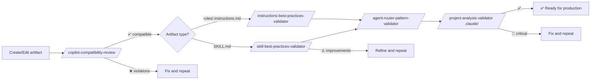

# Agent: quality-validator

> **Model:** `sonnet` | **Tools:** Read, Grep, Glob, Write
> **Role:** Quality & Best-Practices Validator — analyzes existing artifacts against official documentation and team conventions, emits a graded and prioritized quality report.

**What it does:** Reads artifacts (SKILL.md, rules, prompts, entire project), compares against best practices checklist, grades each dimension with ✅ pass / ⚠️ improve / 🚫 violation and suggests concrete corrections.

**What it does NOT do:** Research technologies, generate new artifacts, audit multi-model architecture, or silently rewrite audited files (read-only by default).

**Objective verification:** Uses `grep`, `wc`, `ls` to confirm counts — never trusts declared values without verifying.

---

## Recommended Validation Order

Run in this sequence for increasing coverage:

```
1. /copilot-compatibility-review          ← technical compatibility first
        ↓ if OK
2. /instructions-best-practices-validator ← rules quality
   /skill-best-practices-validator        ← skills quality
        ↓ if OK
3. /agent-router-pattern-validator        ← routing consistency
        ↓ if OK
4. /project-analysis-validator .claude/   ← holistic health
```

---

## /project-analysis-validator

> **Agent:** `quality-validator` | **Context:** fork | **Model invocation:** disabled

### When to Use

Use for a holistic analysis of a complete Claude Code agent project — verifies directory structure, CLAUDE.md accuracy, frontmatter of all artifacts, routing consistency, naming conventions, progressive disclosure and rules coverage.

**Trigger words:** "project health", "audit full project", "verify CLAUDE.md", "project health check", "pre-release validation", "drift between docs and implementation".

### Prerequisites

- Claude Code project with basic structure: `.claude/agents/`, `.claude/skills/`, `.claude/rules/`, `CLAUDE.md`

### Inputs

| Field | Required | Example |
|-------|:-----------:|---------|
| Project path | ✅ | `.claude/` (default) |

### Call Example

```
/project-analysis-validator .claude/
```

### 7 Validation Dimensions

| # | Dimension | What It Verifies |
|---|----------|----------------|
| P1 | Directory structure | `.claude/agents/`, `.claude/skills/`, `.claude/rules/` exist; `CLAUDE.md` present |
| P2 | CLAUDE.md accuracy | Skill/agent/command counts match disk; routing table covers all `context: fork` skills |
| P3 | Frontmatter | Required fields present and valid; `allowed-tools:` in skills, `tools:` in agents |
| P4 | Router consistency | Each `context: fork` skill has `agent:` pointing to an agent that exists in `.claude/agents/` |
| P5 | Naming Conventions | Folder name = frontmatter `name:` field; all kebab-case |
| P6 | Progressive Disclosure | SKILL.md < 500 lines; blueprints used for extensive content |
| P7 | Rules Coverage | At least one `.claude/rules/*.md` covers frontmatter conventions |

### 9 Detected Anti-Patterns

| Anti-Pattern | Description |
|------------|-----------|
| Orphan fork | `context: fork` without `agent:` field |
| Broken agent ref | `agent: foo` but `.claude/agents/foo.md` does not exist |
| Missing `disable-model-invocation` | Command skill without this flag consumes auto-listing budget |
| `tools:` in skill | Should be `allowed-tools:` |
| `allowed-tools:` in agent | Should be `tools:` |
| Name/folder mismatch | Folder name ≠ `name:` in frontmatter |
| Overlong SKILL.md | > 500 lines without blueprints |
| Dead doc reference | CLAUDE.md lists command without corresponding skill folder |
| CLAUDE.md count drift | Declared count ≠ actual count on disk |

### Output Produced

```
.claude/project-analysis-report.md
```

Report structure:
```markdown
# Project Analysis Report

## Executive Summary
Overall score + verdict

## Dimension Results
| Dimension | Score | Status |
|----------|-------|--------|

## Findings by Dimension
[findings per dimension with grade and suggested correction]

## Recommendations by Priority
🚫 Critical — [blocking]
⚠️ Important — [significant improvements]
ℹ️ Low — [minor improvements]
```

### Report Verification

```bash
test -f .claude/project-analysis-report.md && echo "OK" || echo "MISSING"
grep -c "🚫\|⚠️\|✅" .claude/project-analysis-report.md
```

### When to Use vs. Other Validators

| Validator | Scope | Use when |
|-----------|--------|------------|
| `project-analysis-validator` | Entire project | Holistic analysis, pre-release, suspected drift |
| `skill-best-practices-validator` | One skill or skills directory | After creating/editing a specific skill |
| `agent-router-pattern-validator` | Routing pattern | Suspected routing problem |
| `copilot-compatibility-review` | Copilot artifact | Migration, technical compatibility |

---

## /skill-best-practices-validator

> **Agent:** `quality-validator` | **Context:** fork | **Model invocation:** disabled

### When to Use

Use after `/skill-creator` or any generator to verify whether the generated SKILL.md follows the best practices integrated into `skill-creator`.

**Trigger words:** "validate skill", "check SKILL.md", "skill quality check", "verify three-tier", "is the skill correct?".

### Inputs

| Field | Required | Example |
|-------|:-----------:|---------|
| Path to skill or directory | ✅ | `.claude/skills/fastapi-async-api/` or `.claude/skills/` |

### Call Example

```
/skill-best-practices-validator .claude/skills/fastapi-async-api/
```

or to validate all skills:

```
/skill-best-practices-validator .claude/skills/
```

### What It Verifies

| Check | Criterion |
|-------|----------|
| Frontmatter `name` | ≤ 64 chars, kebab-case, without reserved words |
| Frontmatter `description` | Third person, includes "Use when…", ≤ 1536 chars |
| Section ✅ Always Do | Present and with executable code in each pattern |
| Section ⚠️ Ask First | Present with trade-off table |
| Section 🚫 Never Do | Present with inline alternative and impact in each item |
| Progressive disclosure | SKILL.md < 500 lines; blueprints exist if necessary |
| Version absolutism | Specific version declared; no mixing of versions |
| External Resources | Section present with ≥ 1 dated official link |
| `blueprints/evaluation-scenarios.md` | File exists with ≥ 3 scenarios |
| No absolute paths | Without `C:\`, `/Users/`, `/home/` in the body |

### Output Produced

Report in chat (and optionally in a file) with:
- Score per dimension
- Items ✅ pass / ⚠️ improve / 🚫 violation
- Correction suggestion for each ⚠️ and 🚫

---

## /instructions-best-practices-validator

> **Agent:** `quality-validator` | **Context:** fork | **Model invocation:** disabled

### When to Use

Use after `/terraform-instructions-compiler` or when reviewing existing `.claude/rules/*.md` files.

**Trigger words:** "validate rules", "check instructions", ".instructions.md quality", "check scope rules".

### Inputs

| Field | Required | Example |
|-------|:-----------:|---------|
| Path to rules directory | ✅ | `.claude/rules/` or `.github/instructions/` |

### Call Example

```
/instructions-best-practices-validator .claude/rules/
```

### What It Verifies

| Check | What it detects |
|-------|---------------|
| Clear scope | Rules without `paths:` defined or with `paths: "**"` (too broad) |
| Absence of contradictions | Two rules in the same scope with opposing instructions |
| Duplicate content | Same block in multiple files — context pollution |
| Clarity | Vague instructions that the model can interpret in different ways |
| Balanced scope | Neither too broad (affects everything) nor too narrow (never triggers) |
| Valid YAML | Correct frontmatter, required fields |

### Output Produced

Report in chat with quality analysis and prioritized improvement suggestions.

---

## /agent-router-pattern-validator

> **Agent:** `quality-validator` | **Context:** fork | **Model invocation:** disabled

### When to Use

Use to verify whether the routing pattern `/command → sub-agent → skills` is correctly implemented across the entire project — structure, routing, naming, completeness.

**Trigger words:** "check routing", "router pattern", "delegation pattern", "agent structure", "is routing correct?".

### Inputs

| Field | Required | Example |
|-------|:-----------:|---------|
| Project path | Optional | `.claude/` (default) or explicit path |

### Call Example

```
/agent-router-pattern-validator
```

or with explicit path:

```
/agent-router-pattern-validator .claude/
```

### What It Verifies

| Aspect | Verification |
|---------|-------------|
| Structure | All expected directories present |
| Routing | Command skills point to agents that exist |
| Skills Loading | Agents reference skills that exist |
| Naming | kebab-case, gerund-form, consistency between folder and `name:` |
| YAML | Valid frontmatter in all files |
| Completeness | Without dead-ends or orphan components |
| Responsibility separation | Each layer only does what belongs to it |

### Output Produced

```
AGENT_ROUTER_PATTERN_REPORT.md
```

```markdown
## Compliance Score: XX%

## Deviations
| Severity | Item | Suggested Correction |
|-----------|------|-------------------|
| Critical  | ... | ... |
| Warning   | ... | ... |
| Info      | ... | ... |

## Diagram: Current vs. Ideal Routing
```

---

## /copilot-compatibility-review

> **Agent:** `quality-validator` | **Context:** fork | **Model invocation:** disabled

### When to Use

Use as the **first check** after creating any artifact — detects technical compatibility issues with the GitHub Copilot engine (malformed YAML, exceeded field limits, invalid globs) before proceeding to content quality analysis.

**Trigger words:** "Copilot compatibility", "verify YAML", "check field limits", "migration check", "Copilot artifact review".

### Inputs

| Field | Required | Example |
|-------|:-----------:|---------|
| Repository or directory path | ✅ | `.github/` or path to specific artifact |

### Call Example

```
/copilot-compatibility-review .github/
```

or for a specific artifact:

```
/copilot-compatibility-review .github/prompts/skill-creator.prompt.md
```

### What It Verifies

| Field | Limit / Rule | What it detects |
|-------|---------------|---------------|
| `name` | ≤ 64 chars | Silent truncation by the engine |
| `description` | ≤ 1024 chars | Silent truncation |
| `tools` | valid values | Invalid values ignored by the engine |
| `applyTo` glob | valid syntax | Malformed globs that never trigger |
| YAML frontmatter | strict YAML | Missing quotes, wrong indentation, reserved fields |
| Required fields | per artifact type | Missing fields that prevent loading |

### Output Produced

```
COPILOT_COMPATIBILITY_REVIEW.md
```

Violations categorized by severity with suggested correction.

### When to Use This vs. Other Validators

| Use this | When |
|----------|--------|
| `copilot-compatibility-review` | Technical check: YAML, limits, globs — **always first** |
| `skill-best-practices-validator` | Content quality of SKILL.md |
| `instructions-best-practices-validator` | Content quality of rules |
| `project-analysis-validator` | Holistic health of the complete project |
| `agent-router-pattern-validator` | Routing and delegation pattern |

---

## Complete Validation Pipeline



---

## Agent Principles

**Read-only by default** — the agent emits reports and recommendations. Only modifies files if the user explicitly requests it with `--fix`.

**Objective verification** — counts skills with `Glob`, counts lines with `wc`, grep patterns with `grep`. Never accepts declared count without verifying.

**Rubric-driven** — loads the complete rubric from the invoking skill's SKILL.md before reviewing. Does not substitute with general knowledge.

---

*See [manual README](README.md) for general navigation.*
