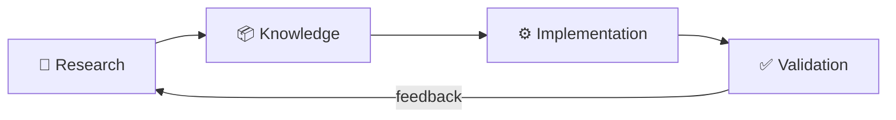
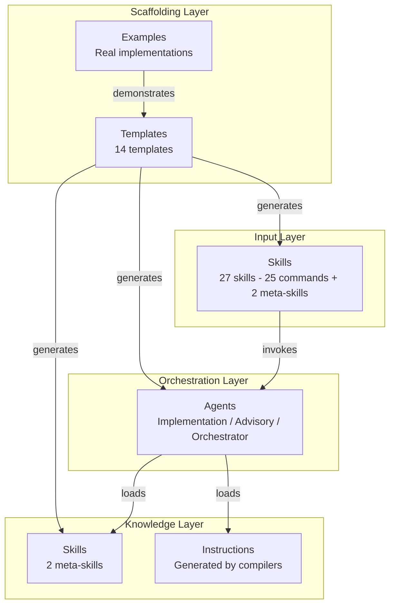
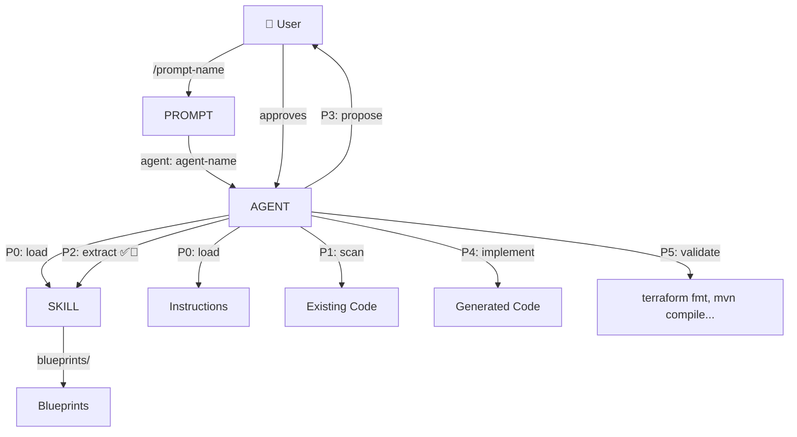
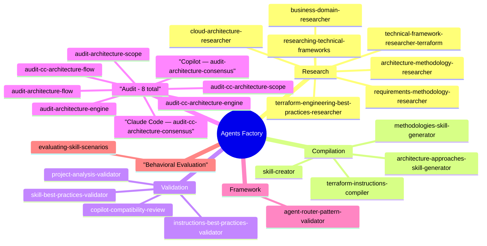
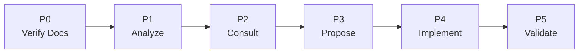

# Overview — Agents Factory

## Mental Model

The Agents Factory operates in a 4-step cycle:

1. **Research** — Investigate technology/methodology with official sources
2. **Knowledge** — Compile into versioned SKILL.md / .instructions.md
3. **Implementation** — Agents use the knowledge to generate code
4. **Validation** — Verify quality and conformance to standards

---

## Component Architecture

---

## Artifact Taxonomy

| Artifact | Extension | Purpose | Who consumes |
|----------|----------|-----------|--------------|
| **Skill** | `SKILL.md` | Versioned knowledge base with ✅⚠️🚫 patterns | Agents (via P0-P2) |
| **Prompt** | `.md` | User entry point — collects context and routes | User via Claude Code |
| **Agent** | `.md` | Orchestrator that loads skills and executes P0-P5 | Prompts (via `agent:` field) |
| **Instruction** | `.instructions.md` | Project/pattern configuration (generated by compilers) | Agents automatically |
| **Template** | `TEMPLATE.*.md` | Scaffolding for creating new artifacts | Humans |
| **Blueprint** | `blueprints/*.md` | Auxiliary patterns (always-do / never-do) | Skills |

---

## Relationship between Components

---

## Capability Categories

---

## Agent Types

| Type | Pattern | Generates code? | Example |
|------|--------|:---:|---------|
| **Implementation** | Full P0-P5 | ✅ | `oci-terraform` |
| **Advisory** | P0-P5 read-only | ❌ | `oci-serverless-architect` |
| **Orchestrator** | P0-P5 cross-domain | ✅ | `oci-serverless-stack` |

---

## Workflow P0-P5

Every agent execution follows these 6 mandatory phases:

| Phase | Action | Failure = |
|------|------|---------|
| **P0** | Load mandatory skills/instructions | Abort — no knowledge |
| **P1** | Scan existing code | Abort — insufficient context |
| **P2** | Extract ✅⚠️🚫 patterns from skills | Abort — no guardrails |
| **P3** | Propose plan to user and await approval | Wait — never implement without approval |
| **P4** | Generate code following exact patterns | — |
| **P5** | Validate with tools (fmt, compile, lint) | Fix and re-validate |
