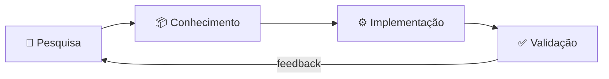
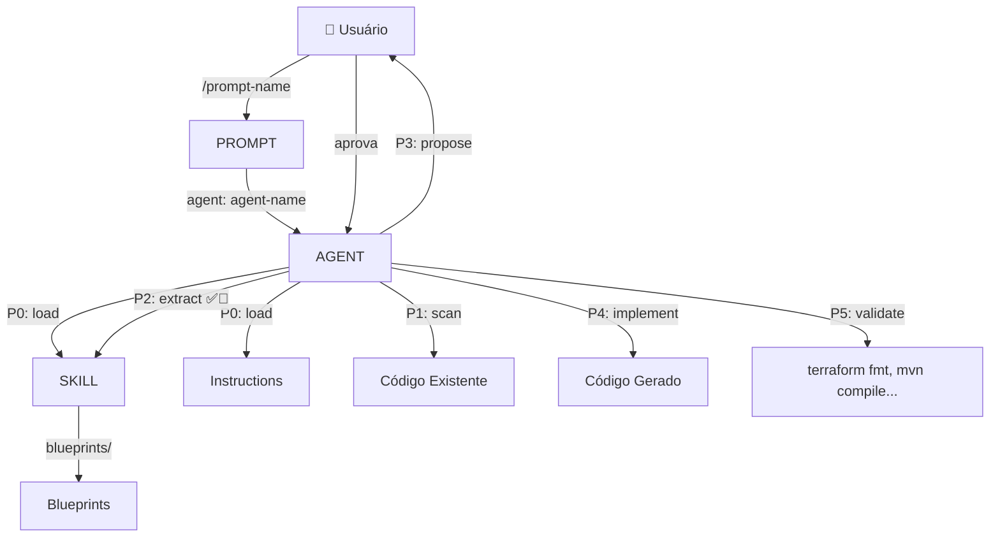
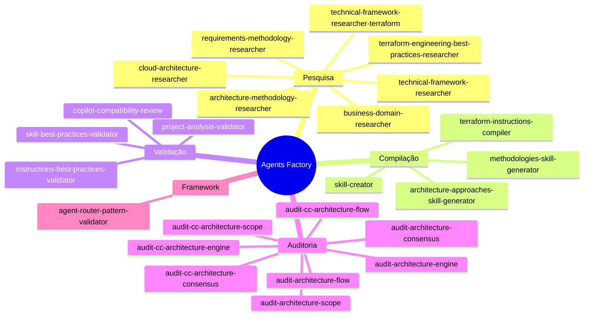
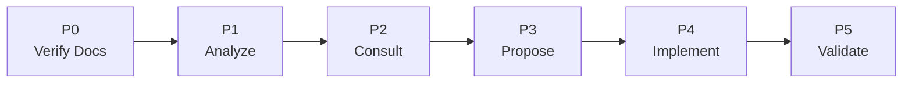

# Visão Geral — Agents Factory

## Modelo Mental

O Agents Factory opera em um ciclo de 4 etapas:



1. **Pesquisa** — Investigar tecnologia/metodologia com fontes oficiais
2. **Conhecimento** — Compilar em SKILL.md / .instructions.md versionado
3. **Implementação** — Agentes usam o conhecimento para gerar código
4. **Validação** — Verificar qualidade e conformidade com padrões

---

## Arquitetura de Componentes

```mermaid
graph TD
    subgraph "Camada de Entrada"
        P[Skills<br/>26 skills (24 comandos + 2 meta-skills)]
    end

    subgraph "Camada de Orquestração"
        AG[Agents<br/>Implementação / Advisory / Orchestrator]
    end

    subgraph "Camada de Conhecimento"
        S[Skills<br/>2 meta-skills]
        I[Instructions<br/>Geradas pelos compilers]
    end

    subgraph "Camada de Scaffolding"
        T[Templates<br/>14 templates]
        E[Exemplos<br/>Implementações reais]
    end

    P -->|invoca| AG
    AG -->|carrega| S
    AG -->|carrega| I
    T -->|gera| P
    T -->|gera| AG
    T -->|gera| S
    E -->|demonstra| T
```

---

## Taxonomia dos Artefatos

| Artefato | Extensão | Propósito | Quem consome |
|----------|----------|-----------|--------------|
| **Skill** | `SKILL.md` | Base de conhecimento versionada com padrões ✅⚠️🚫 | Agentes (via P0-P2) |
| **Prompt** | `.md` | Ponto de entrada do usuário — coleta contexto e roteia | Usuário via Claude Code |
| **Agent** | `.md` | Orquestrador que carrega skills e executa P0-P5 | Prompts (via `agent:` field) |
| **Instruction** | `.instructions.md` | Configuração de projeto/padrões (gerado por compilers) | Agentes automaticamente |
| **Template** | `TEMPLATE.*.md` | Scaffolding para criar novos artefatos | Humanos |
| **Blueprint** | `blueprints/*.md` | Padrões auxiliares (always-do / never-do) | Skills |

---

## Relação entre Componentes



---

## Categorias de Capacidades



---

## Tipos de Agente

| Tipo | Padrão | Gera código? | Exemplo |
|------|--------|:---:|---------|
| **Implementation** | P0-P5 completo | ✅ | `oci-terraform` |
| **Advisory** | P0-P5 read-only | ❌ | `oci-serverless-architect` |
| **Orchestrator** | P0-P5 cross-domain | ✅ | `oci-serverless-stack` |

---

## Workflow P0-P5

Toda execução de agente segue estas 6 fases obrigatórias:



| Fase | Ação | Falha = |
|------|------|---------|
| **P0** | Carregar skills/instructions obrigatórias | Abortar — sem conhecimento |
| **P1** | Escanear código existente | Abortar — contexto insuficiente |
| **P2** | Extrair padrões ✅⚠️🚫 das skills | Abortar — sem guardrails |
| **P3** | Propor plano ao usuário e aguardar aprovação | Aguardar — nunca implementar sem aprovação |
| **P4** | Gerar código seguindo padrões exatos | — |
| **P5** | Validar com ferramentas (fmt, compile, lint) | Corrigir e re-validar |
